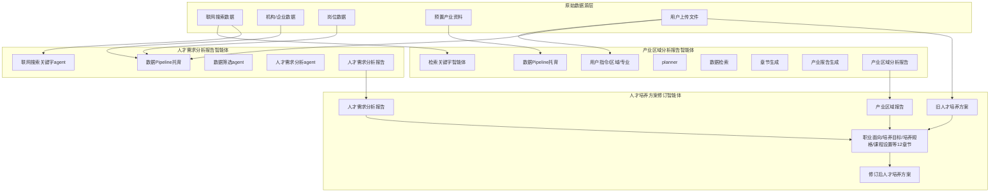

# 托育人才培养方案修订体系：三智能体数据源脉络说明

## 一、文档概述

本文档深度梳理**产业区域分析报告智能体**、**人才需求分析报告智能体**与**人才培养方案修订智能体**三者之间的关系，以及各自数据源的来源、流转与汇聚脉络，为系统理解人才培养方案修订逻辑提供参考。

---

## 二、整体架构与数据流概览



---

## 三、三大数据源详解

人才需求分析报告智能体的数据源明确分为三块，其与产业分析、人才培养方案修订的衔接关系如下。

### 3.1 联网搜索数据（web_data）

| 属性       | 说明                                                                                                                        |
| ---------- | --------------------------------------------------------------------------------------------------------------------------- |
| **变量名** | `web_data`                                                                                                                  |
| **类型**   | string                                                                                                                      |
| **来源**   | 通过联网搜索关键字 agent 从互联网抓取的实时信息                                                                             |
| **用途**   | 产业区域分析、人才需求分析中补充最新政策、招聘、产业动态                                                                    |
| **流向**   | 产业分析：检索关键字 → 数据 Pipeline → 数据提取；人才需求：联网搜索关键字 agent → 代码转化 → 数据 Pipeline → 数据筛选 agent |

联网搜索数据用于补充**时效性**信息，如政策文件、招聘会数据、行业报道等，确保报告与当前形势一致。

### 3.2 机构数据（enterprise_infos）

| 属性       | 说明                                                                                    |
| ---------- | --------------------------------------------------------------------------------------- |
| **变量名** | `enterprise_infos`                                                                      |
| **类型**   | string                                                                                  |
| **来源**   | 用户上传文档、数据库或预置企业/机构名录                                                 |
| **用途**   | 人才需求分析中的企业分布、用人偏好、机构画像                                            |
| **流向**   | 文档提取 → 变量赋值 → 人才需求分析 agent；或在「整理数据结构」中作为 `private` 列表传入 |

机构数据反映**供给侧**（企业、院校、用人主体）的信息，用于刻画用人方结构与需求特征。

### 3.3 岗位数据（career_postings）

| 属性       | 说明                                                                                           |
| ---------- | ---------------------------------------------------------------------------------------------- |
| **变量名** | `career_postings`                                                                              |
| **类型**   | string                                                                                         |
| **来源**   | 用户上传岗位表、招聘数据或通过数据 Pipeline 获取的岗位信息                                     |
| **用途**   | 人才需求分析中的岗位结构、技能要求、能力画像                                                   |
| **流向**   | 在「整理数据结构」节点中作为 `postData` 列表，与 network、private 合并后传入人才需求分析 agent |

岗位数据反映**需求侧**的岗位分布与能力要求，是培养目标、课程设置、职业面向的直接参照。

### 3.4 三块数据在「整理数据结构」中的汇聚

人才需求分析报告智能体中的 `1754651516960_整理数据结构` 节点，将三块数据统一整理为：

- `network`：联网搜索数据
- `postData`：岗位数据
- `private`：机构/企业数据

输出为统一的 JSON 结构，供后续人才需求分析 agent 及报告生成使用。

---

## 四、产业区域分析报告智能体

### 4.1 功能定位

面向指定区域、专业，生成《产业区域分析报告》，为人才培养方案提供**产业背景、政策环境、区域格局**等宏观依据。

### 4.2 数据源

| 数据源类型       | 说明                                                         | 接入方式                                 |
| ---------------- | ------------------------------------------------------------ | ---------------------------------------- |
| **用户指令**     | 区域、专业、院校等参数                                       | 工作流 start 节点输入                    |
| **预置数据**     | 产业政策、区域发展资料（如 ceshi_data 中的香港 AI 发展内容） | conversation 变量 `ceshi_data`           |
| **联网搜索**     | 政策、招聘会、产业报道等                                     | 检索关键字智能体 → 数据 Pipeline（托育） |
| **获取区域时间** | 当前时间、区域参数                                           | 工具节点                                 |

### 4.3 核心流程

1. **条件分支 5**：区分用户意图（新建报告 / 图表展示 / 其他）
2. **planner**：规划报告章节与检索策略
3. **数据检索**：基于关键字从数据 Pipeline 获取产业数据
4. **储存**：将检索结果写入变量
5. **产业报告生成** / **章节生成**：按章节生成报告内容
6. **echarts 转化图片**：生成图表
7. **Markdown 转 DOCX**：输出报告文档

### 4.4 输出

- **产业区域分析报告**（Markdown/DOCX）
- 作为人才培养方案修订智能体的输入变量 `industrial_area_report`

---

## 五、人才需求分析报告智能体

### 5.1 功能定位

整合联网搜索、机构、岗位三类数据，生成《人才需求分析报告》，刻画目标专业的**岗位结构、能力要求、供需缺口**，为培养目标与课程设置提供依据。

### 5.2 数据源（三块）

| 数据块           | 变量/节点          | 来源                     | 说明                         |
| ---------------- | ------------------ | ------------------------ | ---------------------------- |
| **联网搜索数据** | `web_data`         | 联网搜索关键字 agent     | 实时政策、招聘信息、行业动态 |
| **机构数据**     | `enterprise_infos` | 用户上传文档 / 数据库    | 企业分布、用人偏好、机构画像 |
| **岗位数据**     | `career_postings`  | 用户上传 / 数据 Pipeline | 岗位结构、技能要求、能力画像 |

### 5.3 核心流程

1. **计算跳转分支**：根据会话状态决定执行路径
2. **获取文件名**：解析用户上传文件
3. **文档提取**：从上传文件中提取文本
4. **联网搜索关键字 agent**：生成搜索关键词，获取 `web_data`
5. **代码转化** → **数据 Pipeline（托育）**：获取机构、岗位等结构化数据
6. **过滤重复数据** → **token 量安全保证器** → **数据筛选 agent**：清洗与筛选
7. **提取 json** → **剔除不相干内容** → **整理数据结构**：统一为 network、postData、private
8. **人才需求分析 agent**：基于三块数据生成分析报告
9. **echart 转图片** → **Markdown 转 DOCX**：输出报告

### 5.4 输出

- **人才需求分析报告**（Markdown/DOCX）
- 作为人才培养方案修订智能体的输入变量 `talent_demand_analysis`

---

## 六、人才培养方案修订智能体

### 6.1 功能定位

以《产业区域分析报告》《人才需求分析报告》和《旧人才培养方案》为输入，按职业面向、培养目标、培养规格等 12 个章节逐项修订，输出新版《人才培养方案》。

### 6.2 输入（三大核心数据）

| 输入变量                      | 说明             | 来源                                  |
| ----------------------------- | ---------------- | ------------------------------------- |
| `industrial_area_report`      | 产业区域分析报告 | 产业区域分析报告智能体输出 / 用户上传 |
| `talent_demand_analysis`      | 人才需求分析报告 | 人才需求分析报告智能体输出 / 用户上传 |
| `old_talent_development_plan` | 旧人才培养方案   | 用户上传                              |

此外还有 `web_data`、`docs` 等辅助数据。

### 6.3 修订逻辑（12 章节）

修订按以下章节顺序依次进行，每章均结合产业报告、需求报告与旧方案生成或修订内容：

1. 职业面向
2. 培养目标
3. 培养规格
4. 课程设置
5. 教学安排
6. 师资队伍
7. 教学设施
8. 教学资源
9. 教学方案
10. 教学评价
11. 质量管理
12. 毕业要求
13. 最终方案（汇总）

### 6.4 数据使用关系

- **产业区域报告**：提供区域产业格局、政策环境、发展导向，用于定位专业与培养方向
- **人才需求报告**：提供岗位结构、能力要求、供需缺口，用于培养目标、课程设置、职业面向
- **旧人才培养方案**：作为修订基底，保留合理部分，根据前两份报告进行增删改

### 6.5 输出

- **修订后人才培养方案**（Markdown/DOCX）

---

## 七、数据源脉络总览

```mermaid
flowchart LR
    subgraph Raw [原始数据]
        R1[联网搜索]
        R2[机构/企业]
        R3[岗位数据]
        R4[预置产业资料]
        R5[用户上传文件]
    end

    subgraph Report1 [产业区域分析报告]
        R1 -.-> Report1
        R4 -.-> Report1
        R5 -.-> Report1
    end

    subgraph Report2 [人才需求分析报告]
        R1 --> Report2
        R2 --> Report2
        R3 --> Report2
        R5 -.-> Report2
    end

    subgraph Plan [人才培养方案修订]
        Report1 --> Plan
        Report2 --> Plan
        R5 -.-> Plan
    end

    Plan --> Output[修订后人才培养方案]
```

### 7.1 脉络要点

1. **产业区域分析报告**：以联网搜索、预置资料、用户上传为主，产出产业与政策背景。
2. **人才需求分析报告**：明确依赖三块数据——联网搜索、机构、岗位，经 Pipeline 与数据筛选后生成。
3. **人才培养方案修订**：以产业报告、需求报告、旧方案为输入，经 12 章节的 LLM 修订流程，输出新方案。
4. **用户上传**：贯穿全流程，可补充产业资料、机构/岗位数据、旧方案等，实现灵活定制。

---

## 八、相关文件索引

| 智能体           | 工作流 YAML                                                                                                                                                         | 结构文档                                                                                          |
| ---------------- | ------------------------------------------------------------------------------------------------------------------------------------------------------------------- | ------------------------------------------------------------------------------------------------- |
| 产业区域分析报告 | [industry-regional-analysis-report-chatflow/托育 - 产业分析智能体(ceshi).yml](<../industry-regional-analysis-report-chatflow/托育%20-%20产业分析智能体(ceshi).yml>) | [workflow_structure.md](../industry-regional-analysis-report-chatflow/docs/workflow_structure.md) |
| 人才需求分析报告 | [talent-demand-analysis-report-chatflow/托育 - 人才需求分析智能体.yml](../talent-demand-analysis-report-chatflow/托育%20-%20人才需求分析智能体.yml)                 | [workflow_structure.md](../talent-demand-analysis-report-chatflow/docs/workflow_structure.md)     |
| 人才培养方案修订 | [talent-training-plan-chatflow/托育人才培养方案智能体.yml](../talent-training-plan-chatflow/托育人才培养方案智能体.yml)                                             | [workflow_structure.md](../talent-training-plan-chatflow/docs/workflow_structure.md)              |

---

_文档版本：v1.0 | 基于当前工作流 YAML 及节点实现整理_
