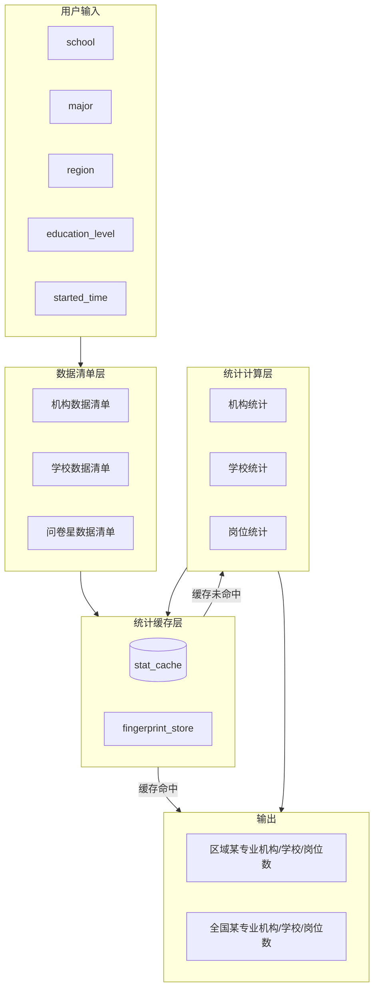

# 托育专业数据统计管道设计案

## 一、需求概述

### 1.1 场景需求

用户输入：`school`、`major`、`region`、`education_level`、`started_time`（调研数据开始时间）

智能体在生成**人才需求分析报告**和**产业区域分析报告**时，需获取：

- **区域维度**：某区域 + 某专业的 岗位总数 / 机构总数 / 学校总数
- **全国维度**：某专业的 岗位总数 / 机构总数 / 学校总数（全国）

用于支撑高质量报告的统计口径。

### 1.2 增量统计约束

问卷星、机构、学校数据为**定期上传后更新**。当数据未更新时，**不应重新统计**，应直接返回已缓存的统计量。

---

## 二、数据源元数据定义

### 2.1 托育机构平台注册备案数据（机构数据）

| 属性          | 说明                               |
| ------------- | ---------------------------------- |
| **文件路径**  | `db/托育机构平台注册备案数据.json` |
| **格式**      | JSON Array                         |
| **Item 结构** | 见下表                             |

| 字段                     | 类型   | 说明                                                             | 统计用途              |
| ------------------------ | ------ | ---------------------------------------------------------------- | --------------------- |
| `zoning_code`            | string | 区划代码                                                         | -                     |
| `zoning_name`            | string | 区划名称，如「云南省大理白族自治州大理市」「陕西省西安市莲湖区」 | 区域筛选（解析省/市） |
| `institution_type`       | string | 机构类型：非营利性/营利性/事业单位                               | 风控、主体分布        |
| `institution_name`       | string | 机构名称                                                         | -                     |
| `institution_other_name` | string | 机构别名                                                         | -                     |
| `address`                | string | 地址                                                             | -                     |
| `credit_code`            | string | 统一社会信用代码                                                 | -                     |
| `finished_time`          | string | 备案完成时间                                                     | 时间范围筛选          |

**区域解析规则**：`zoning_name` 首段为省份（如「云南省」「陕西省」），可提取省、市用于 region 匹配。

### 2.2 托育学校注册备案数据（学校数据）

| 属性              | 说明                                                            |
| ----------------- | --------------------------------------------------------------- |
| **目录路径**      | `db/托育学校注册备案数据/`                                      |
| **文件命名**      | `moe_majors_{省份}_{年份}.txt`，如 `moe_majors_安徽省_2013.txt` |
| **Record 分隔符** | `^_^`（在备注字段中）                                           |
| **Item 结构**     | 见下表                                                          |

| 字段       | 示例                                              | 说明            | 统计用途             |
| ---------- | ------------------------------------------------- | --------------- | -------------------- |
| 机构名称   | 安徽大学                                          | 学校名称        | school 匹配          |
| 省份       | 安徽省                                            | 所在省份        | region 筛选          |
| 学校标识码 | 10357                                             | 教育部标识      | -                    |
| 开设专业   | 早期教育 (570101K)、婴幼儿托育服务与管理 (520802) | 专业名称 + 代码 | major 筛选           |
| 修业年限   | 2/3                                               | 学制            | education_level 推断 |
| 年份       | 2013                                              | 备案年份        | started_time 筛选    |
| 备注       | ^\_^                                              | 记录分隔        | -                    |

**托育相关专业代码**：`570101K`（早期教育）、`520802`（婴幼儿托育服务与管理）等。

### 2.3 问卷星统计（岗位/需求调研数据）

| 属性                     | 说明                                                   |
| ------------------------ | ------------------------------------------------------ |
| **文件路径**             | `db/问卷星统计_托育机构人才需求专项调查_20260120.xlsx` |
| **格式**                 | Excel (xlsx)                                           |
| **用途（参考思维导图）** | 最缺岗位、薪酬趋势、证书需求、人才能力模型             |

**Item 逻辑**：每行为一份问卷/机构反馈，包含岗位需求、薪酬、证书等字段。  
**岗位数统计口径**：可定义为「有效问卷中提及某岗位的机构数」或「有效问卷总数」（作为需求样本量）。

---

## 三、统计管道架构

### 3.1 整体流程



### 3.2 增量判断逻辑

```
对每个数据源维护 fingerprint：
  fingerprint = hash(file_path + mtime + filesize)
  或对多文件：hash(各文件 path+mtime+size 的联合)

查询时：
  1. 根据 (school, major, region, education_level, started_time) 生成 query_key
  2. 对机构/学校/问卷星分别取当前 fingerprint
  3. 若 stat_cache 中存在 (query_key, data_source, fingerprint) 且 fingerprint 一致
     → 直接返回缓存统计量
  4. 否则 → 重新统计，写入 cache，更新 fingerprint_store
```

---

## 四、统计维度与输出规格

### 4.1 查询键 (query_key)

| 维度              | 说明                             | 示例                          |
| ----------------- | -------------------------------- | ----------------------------- |
| `school`          | 院校名称（可选，用于“我校”对比） | 广东职业技术学院              |
| `major`           | 专业名称或代码                   | 婴幼儿托育服务与管理 / 520802 |
| `region`          | 区域，省或市                     | 广东省 / 广州市               |
| `education_level` | 学历层次                         | 高职专科 / 本科               |
| `started_time`    | 调研数据开始年份                 | 2020                          |

### 4.2 输出结构

```json
{
  "region_stats": {
    "institution_count": 1234,
    "school_count": 56,
    "posting_count": 890
  },
  "national_stats": {
    "institution_count": 267000,
    "school_count": 1200,
    "posting_count": 15000
  },
  "meta": {
    "data_fingerprints": {
      "institution": "a1b2c3...",
      "school": "d4e5f6...",
      "questionnaire": "g7h8i9..."
    },
    "computed_at": "2026-02-05T10:00:00Z"
  }
}
```

---

## 五、各数据源统计实现要点

### 5.1 机构统计

- **数据源**：`db/托育机构平台注册备案数据.json`
- **区域匹配**：从 `zoning_name` 解析省份（取首段，如「云南省」「陕西省」），与 `region` 匹配；若 region 为市，则需解析到市级。
- **专业匹配**：机构数据无专业字段，按「该区域所有托育机构」统计，即机构数按 region 筛选即可。
- **输出**：`region_stats.institution_count`，`national_stats.institution_count`（全国即不按 region 筛选）。

### 5.2 学校统计

- **数据源**：`db/托育学校注册备案数据/moe_majors_{省}_{年}.txt`
- **筛选条件**：
  - `省份` = region（或 region 对应的省）
  - `开设专业` 包含 major 或对应专业代码（如 520802、570101K）
  - `年份` >= started_time（可选，按调研起始年过滤）
- **education_level**：可根据修业年限（2/3 为专科，4/5 为本科）或学校类型进一步细分。
- **输出**：`region_stats.school_count`，`national_stats.school_count`。

### 5.3 岗位统计

- **数据源**：
  - 问卷星：`db/问卷星统计_托育机构人才需求专项调查_20260120.xlsx`（岗位需求、薪酬等）
  - 若有招聘数据：单独文件或表（当前 db 中未发现，可扩展）
- **统计口径**：
  - 方案 A：问卷星有效问卷数作为「需求样本量」
  - 方案 B：问卷星中「最缺岗位」等字段聚合，得到岗位类型分布及数量
- **输出**：`region_stats.posting_count`，`national_stats.posting_count`。  
  若问卷星无区域字段，岗位数可能仅支持全国维度。

---

## 六、缓存与清单设计

### 6.1 目录结构建议

```
db/
├── 托育机构平台注册备案数据.json
├── 问卷星统计_托育机构人才需求专项调查_20260120.xlsx
├── 托育学校注册备案数据/
│   └── moe_majors_{省}_{年}.txt
├── _manifest/                    # 数据清单（可选，便于版本管理）
│   ├── institution.json
│   ├── school.json
│   └── questionnaire.json
└── _stats_cache/                 # 统计缓存
    ├── cache.db                  # SQLite 或
    └── cache/
        └── {query_hash}.json     # 按查询键分文件
```

### 6.2 缓存表结构（SQLite 示例）

```sql
CREATE TABLE stat_cache (
  id INTEGER PRIMARY KEY,
  query_key TEXT NOT NULL,           -- hash(school,major,region,education_level,started_time)
  data_source TEXT NOT NULL,         -- 'institution'|'school'|'questionnaire'
  fingerprint TEXT NOT NULL,         -- 数据源 fingerprint
  scope TEXT NOT NULL,               -- 'region'|'national'
  stat_value INTEGER NOT NULL,       -- 统计值
  computed_at TEXT NOT NULL,
  UNIQUE(query_key, data_source, scope)
);

CREATE TABLE data_fingerprints (
  data_source TEXT PRIMARY KEY,
  fingerprint TEXT NOT NULL,
  file_path TEXT,
  mtime REAL,
  updated_at TEXT
);
```

### 6.3 Fingerprint 计算

```python
# 伪代码
def get_fingerprint(source: str) -> str:
    if source == 'institution':
        path = 'db/托育机构平台注册备案数据.json'
        return hash(path + mtime(path) + size(path))
    if source == 'school':
        dir_path = 'db/托育学校注册备案数据'
        files = list_txt_files(dir_path)
        return hash(concat(f + mtime(f) + size(f) for f in sorted(files)))
    if source == 'questionnaire':
        path = 'db/问卷星统计_托育机构人才需求专项调查_20260120.xlsx'
        return hash(path + mtime(path) + size(path))
```

---

## 七、与智能体的对接方式

### 7.1 数据 Pipeline（托育）扩展

在 Dify 工作流中，将「数据 Pipeline（托育）」扩展为可调用统计管道：

**输入**：`school`, `major`, `region`, `education_level`, `started_time`

**输出**：上述 `region_stats` 与 `national_stats` 的 JSON。

**实现方式**（任选其一）：

1. **HTTP API**：统计管道以 FastAPI/Flask 提供 `/api/stats`，Dify 通过 HTTP Request 节点调用
2. **Python 工具节点**：在 Dify 中新增 Code 节点，内部调用本地 `stats_pipeline.get_stats(...)`
3. **数据库/缓存读取**：统计管道异步预计算并写入 DB/Redis，Dify 通过工具节点查询

### 7.2 报告生成时的使用

人才需求分析、产业区域分析智能体在生成报告时，将 `region_stats`、`national_stats` 作为上下文注入 Prompt，例如：

```
【统计数据】
- 广东省托育机构总数：{region_stats.institution_count}
- 全国托育机构总数：{national_stats.institution_count}
- 广东省开设婴幼儿托育服务与管理专业的院校数：{region_stats.school_count}
- 全国开设该专业的院校数：{national_stats.school_count}
...
```

---

## 八、实施步骤建议

| 阶段 | 内容                                                                            |
| ---- | ------------------------------------------------------------------------------- |
| 1    | 实现 fingerprint 计算与缓存读写模块                                             |
| 2    | 实现机构统计（JSON 解析 + 区域匹配）                                            |
| 3    | 实现学校统计（多文件解析 + 专业/省份/年份筛选）                                 |
| 4    | 实现问卷星岗位统计（xlsx 解析 + 统计口径定义）                                  |
| 5    | 封装统一 `get_stats(school, major, region, education_level, started_time)` 接口 |
| 6    | 与 Dify 数据 Pipeline 或 HTTP 工具对接                                          |
| 7    | 在报告生成 Prompt 中注入统计数据                                                |

---

## 九、附录：区域解析参考

`zoning_name` 常见格式与解析方式：

| 示例                       | 解析省 | 解析市         |
| -------------------------- | ------ | -------------- |
| 云南省大理白族自治州大理市 | 云南省 | 大理白族自治州 |
| 陕西省西安市莲湖区         | 陕西省 | 西安市         |
| 江苏省南京市鼓楼区         | 江苏省 | 南京市         |
| 山东省潍坊市临朐县         | 山东省 | 潍坊市         |

解析逻辑：以第一个「省」「自治区」「市」等关键词切分，首段为省，第二段为市（若存在）。

---

_文档版本：v1.0 | 基于 db 元数据与思维导图整理_
