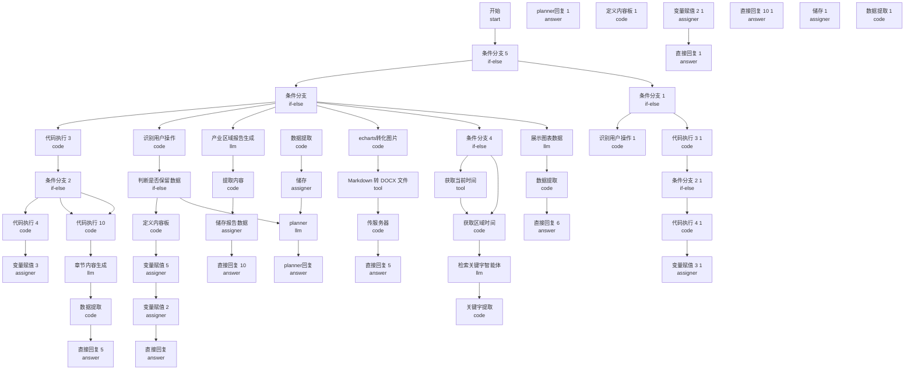

# 托育 - 产业分析智能体(ceshi) - 工作流结构文档

## 节点信息表

| 节点 ID           | 类型     | 标题                      | 描述 |
| ----------------- | -------- | ------------------------- | ---- |
| `1754636636322`   | start    | 开始                      |      |
| `1754646332788`   | answer   | planner 回复              |      |
| `1754647076852`   | if-else  | 条件分支                  |      |
| `1754647810635`   | code     | 识别用户操作              |      |
| `1754652202741`   | code     | 定义内容板                |      |
| `1754653694381`   | assigner | 变量赋值 2                |      |
| `1754672700464`   | code     | 代码执行 3                |      |
| `1754674298555`   | code     | 代码执行 4                |      |
| `1754675253814`   | assigner | 变量赋值 3                |      |
| `1754675678328`   | if-else  | 条件分支 2                |      |
| `1754676097510`   | llm      | 产业区域报告生成          |      |
| `1754676900518`   | answer   | 直接回复                  |      |
| `1754677616257`   | answer   | 直接回复 10               |      |
| `1754707863719`   | llm      | 检索关键字智能体          |      |
| `1754710576286`   | code     | 关键字提取                |      |
| `1754711661699`   | code     | 数据提取                  |      |
| `1754712012856`   | assigner | 储存                      |      |
| `17547328688300`  | code     | 数据提取                  |      |
| `17547338453580`  | code     | 提取内容                  |      |
| `1754746449525`   | if-else  | 判断是否保留数据          |      |
| `1754748177625`   | answer   | 直接回复 5                |      |
| `1754773478475`   | tool     | Markdown 转 DOCX 文件     |      |
| `1754773533821`   | answer   | 直接回复 5                |      |
| `1754773805987`   | assigner | 储存报告数据              |      |
| `1754879989175`   | answer   | 直接回复 6                |      |
| `17548804862240`  | code     | 数据提取                  |      |
| `1754995084281`   | assigner | 变量赋值 5                |      |
| `1755056952703`   | code     | 代码执行 10               |      |
| `17552526619620`  | llm      | 章节内容生成              |      |
| `17552551696280`  | llm      | planner                   |      |
| `1755316426769`   | code     | echarts 转化图片          |      |
| `1755482842243`   | tool     | 获取当前时间              |      |
| `1755485385133`   | if-else  | 条件分支 4                |      |
| `1755485696349`   | code     | 获取区域时间              |      |
| `17555035085930`  | llm      | 展示图表数据              |      |
| `1761725745439`   | code     | 传服务器                  |      |
| `1761752758390`   | if-else  | 条件分支 5                |      |
| `17617527910370`  | answer   | planner 回复 (1)          |      |
| `17617527910371`  | if-else  | 条件分支 (1)              |      |
| `176175279103710` | answer   | 直接回复 (1)              |      |
| `176175279103711` | answer   | 直接回复 10 (1)           |      |
| `176175279103715` | assigner | 储存 (1)                  |      |
| `176175279103716` | code     | 数据提取 (1)              |      |
| `176175279103717` | code     | 提取内容 (1)              |      |
| `176175279103718` | if-else  | 判断是否保留数据 (1)      |      |
| `176175279103719` | answer   | 直接回复 5 (1)            |      |
| `17617527910372`  | code     | 识别用户操作 (1)          |      |
| `176175279103720` | tool     | Markdown 转 DOCX 文件 (1) |      |
| `176175279103721` | answer   | 直接回复 5 (1)            |      |
| `176175279103722` | assigner | 储存报告数据 (1)          |      |
| `176175279103723` | answer   | 直接回复 6 (1)            |      |
| `176175279103724` | code     | 数据提取 (1)              |      |
| `176175279103726` | assigner | 变量赋值 5 (1)            |      |
| `176175279103727` | code     | 代码执行 10 (1)           |      |
| `17617527910373`  | code     | 定义内容板 (1)            |      |
| `176175279103730` | code     | echarts 转化图片 (1)      |      |
| `176175279103731` | tool     | 获取当前时间 (1)          |      |
| `176175279103732` | if-else  | 条件分支 4 (1)            |      |
| `176175279103733` | code     | 获取区域时间 (1)          |      |
| `176175279103734` | llm      | 展示图表数据 (1)          |      |
| `176175279103735` | code     | 传服务器 (1)              |      |
| `17617527910374`  | assigner | 变量赋值 2 (1)            |      |
| `17617527910375`  | code     | 代码执行 3 (1)            |      |
| `17617527910376`  | code     | 代码执行 4 (1)            |      |
| `17617527910377`  | assigner | 变量赋值 3 (1)            |      |
| `17617527910378`  | if-else  | 条件分支 2 (1)            |      |
| `1761753253058`   |          |                           |      |
| `1761753281620`   |          |                           |      |
| `1761754543279`   | code     | planner                   |      |
| `17617548759770`  | code     | 数据检索                  |      |
| `17617550421550`  | code     | 章节生成                  |      |
| `17617551101780`  | code     | 产业报告生成              |      |
| `1769505099545`   | tool     | 数据 Pipeline（托育）     |      |

## 连接关系图



_注：由于节点数量较多，图中仅显示前 50 个节点和前 100 条连接关系。_

## 数据统计管道输出格式

本智能体依赖**数据 Pipeline（托育）**获取机构、学校、岗位统计数据。Pipeline 输出结构如下，供报告生成时注入 Prompt。

### 输入参数

| 参数            | 类型   | 说明                                             |
| --------------- | ------ | ------------------------------------------------ |
| school          | string | 院校名称（可选）                                 |
| major           | string | 专业名称或代码，如 婴幼儿托育服务与管理 / 520802 |
| region          | string | 区域，省或市，如 广东省 / 广州市                 |
| education_level | string | 学历层次，如 高职专科 / 本科                     |
| started_time    | int    | 调研数据开始年份                                 |

### 输出结构

```json
{
  "stats": {
    "region": {
      "institution_count": 2927,
      "school_count": 189,
      "posting_sample_count": 0,
      "matched_institution_count": 0
    },
    "national": {
      "institution_count": 62668,
      "school_count": 3224,
      "posting_sample_count": 0,
      "matched_institution_count": 0
    }
  },
  "details": {
    "institutions": [
      {
        "institution_name": "机构名",
        "institution_other_name": "机构别名",
        "zoning_name": "区划名称",
        "institution_type": "机构类型",
        "address": "地址"
      }
    ],
    "schools": [
      {
        "机构名称": "学校名",
        "省份": "广东省",
        "开设专业": "婴幼儿托育服务与管理 (520802)",
        "修业年限": "3",
        "年份": "2021"
      }
    ],
    "questionnaire_posting": {},
    "questionnaire_details_sample": [],
    "cross_validation": {
      "region_matched_count": 0,
      "national_matched_count": 0
    }
  },
  "meta": {
    "from_cache": false,
    "fingerprints": {
      "institution": "...",
      "school": "...",
      "questionnaire": "..."
    }
  }
}
```

### 统计字段说明

| 字段                                   | 说明                                 |
| -------------------------------------- | ------------------------------------ |
| stats.region.institution_count         | 区域托育机构总数                     |
| stats.region.school_count              | 区域开设指定专业培养点记录数         |
| stats.region.posting_sample_count      | 区域问卷星有效样本数                 |
| stats.region.matched_institution_count | 机构备案与问卷星匹配数               |
| stats.national.\*                      | 全国维度对应统计                     |
| details.institutions                   | 机构详情列表（上为统计数，下为详情） |
| details.schools                        | 学校详情列表                         |
| details.cross_validation               | 机构与问卷星交叉验证结果             |

## 详细连接关系

### 按源节点分组

#### `1754636636322` - 开始

连接到以下 1 个节点：

- `1761752758390` - 条件分支 5

#### `1754647076852` - 条件分支

连接到以下 6 个节点：

- `1754672700464` - 代码执行 3
- `1754647810635` - 识别用户操作
- `1754676097510` - 产业区域报告生成
- `1755316426769` - echarts 转化图片
- `1755485385133` - 条件分支 4
- `17555035085930` - 展示图表数据

#### `1754647810635` - 识别用户操作

连接到以下 1 个节点：

- `1754746449525` - 判断是否保留数据

#### `1754652202741` - 定义内容板

连接到以下 1 个节点：

- `1754995084281` - 变量赋值 5

#### `1754653694381` - 变量赋值 2

连接到以下 1 个节点：

- `1754676900518` - 直接回复

#### `1754672700464` - 代码执行 3

连接到以下 1 个节点：

- `1754675678328` - 条件分支 2

#### `1754674298555` - 代码执行 4

连接到以下 1 个节点：

- `1754675253814` - 变量赋值 3

#### `1754675678328` - 条件分支 2

连接到以下 3 个节点：

- `1754674298555` - 代码执行 4
- `1755056952703` - 代码执行 10
- `1755056952703` - 代码执行 10

#### `1754676097510` - 产业区域报告生成

连接到以下 1 个节点：

- `17547338453580` - 提取内容

#### `1754707863719` - 检索关键字智能体

连接到以下 1 个节点：

- `1754710576286` - 关键字提取

#### `1754710576286` - 关键字提取

连接到以下 1 个节点：

- `1769505099545` - 数据 Pipeline（托育）

#### `1754711661699` - 数据提取

连接到以下 1 个节点：

- `1754712012856` - 储存

#### `1754712012856` - 储存

连接到以下 1 个节点：

- `17552551696280` - planner

#### `17547328688300` - 数据提取

连接到以下 1 个节点：

- `1754748177625` - 直接回复 5

#### `17547338453580` - 提取内容

连接到以下 1 个节点：

- `1754773805987` - 储存报告数据

#### `1754746449525` - 判断是否保留数据

连接到以下 2 个节点：

- `1754652202741` - 定义内容板
- `17552551696280` - planner

#### `1754773478475` - Markdown 转 DOCX 文件

连接到以下 1 个节点：

- `1761725745439` - 传服务器

#### `1754773805987` - 储存报告数据

连接到以下 1 个节点：

- `1754677616257` - 直接回复 10

#### `17548804862240` - 数据提取

连接到以下 1 个节点：

- `1754879989175` - 直接回复 6

#### `1754995084281` - 变量赋值 5

连接到以下 1 个节点：

- `1754653694381` - 变量赋值 2

#### `1755056952703` - 代码执行 10

连接到以下 1 个节点：

- `17552526619620` - 章节内容生成

#### `17552526619620` - 章节内容生成

连接到以下 1 个节点：

- `17547328688300` - 数据提取

#### `17552551696280` - planner

连接到以下 1 个节点：

- `1754646332788` - planner 回复

#### `1755316426769` - echarts 转化图片

连接到以下 1 个节点：

- `1754773478475` - Markdown 转 DOCX 文件

#### `1755482842243` - 获取当前时间

连接到以下 1 个节点：

- `1755485696349` - 获取区域时间

#### `1755485385133` - 条件分支 4

连接到以下 2 个节点：

- `1755482842243` - 获取当前时间
- `1755485696349` - 获取区域时间

#### `1755485696349` - 获取区域时间

连接到以下 1 个节点：

- `1754707863719` - 检索关键字智能体

#### `17555035085930` - 展示图表数据

连接到以下 1 个节点：

- `17548804862240` - 数据提取

#### `1761725745439` - 传服务器

连接到以下 1 个节点：

- `1754773533821` - 直接回复 5

#### `1761752758390` - 条件分支 5

连接到以下 2 个节点：

- `1754647076852` - 条件分支
- `17617527910371` - 条件分支 (1)

#### `17617527910371` - 条件分支 (1)

连接到以下 6 个节点：

- `17617527910372` - 识别用户操作 (1)
- `17617527910375` - 代码执行 3 (1)
- `176175279103732` - 条件分支 4 (1)
- `176175279103730` - echarts 转化图片 (1)
- `176175279103734` - 展示图表数据 (1)
- `17617551101780` - 产业报告生成

#### `176175279103715` - 储存 (1)

连接到以下 1 个节点：

- `1761754543279` - planner

#### `176175279103716` - 数据提取 (1)

连接到以下 1 个节点：

- `176175279103719` - 直接回复 5 (1)

#### `176175279103717` - 提取内容 (1)

连接到以下 1 个节点：

- `176175279103722` - 储存报告数据 (1)

#### `176175279103718` - 判断是否保留数据 (1)

连接到以下 1 个节点：

- `17617527910373` - 定义内容板 (1)

#### `17617527910372` - 识别用户操作 (1)

连接到以下 1 个节点：

- `176175279103718` - 判断是否保留数据 (1)

#### `176175279103720` - Markdown 转 DOCX 文件 (1)

连接到以下 1 个节点：

- `176175279103735` - 传服务器 (1)

#### `176175279103722` - 储存报告数据 (1)

连接到以下 1 个节点：

- `176175279103711` - 直接回复 10 (1)

#### `176175279103724` - 数据提取 (1)

连接到以下 1 个节点：

- `176175279103723` - 直接回复 6 (1)

#### `176175279103726` - 变量赋值 5 (1)

连接到以下 1 个节点：

- `17617527910374` - 变量赋值 2 (1)

#### `176175279103727` - 代码执行 10 (1)

连接到以下 1 个节点：

- `17617550421550` - 章节生成

#### `17617527910373` - 定义内容板 (1)

连接到以下 1 个节点：

- `176175279103726` - 变量赋值 5 (1)

#### `176175279103730` - echarts 转化图片 (1)

连接到以下 1 个节点：

- `176175279103720` - Markdown 转 DOCX 文件 (1)

#### `176175279103731` - 获取当前时间 (1)

连接到以下 1 个节点：

- `176175279103733` - 获取区域时间 (1)

#### `176175279103732` - 条件分支 4 (1)

连接到以下 2 个节点：

- `176175279103733` - 获取区域时间 (1)
- `176175279103731` - 获取当前时间 (1)

#### `176175279103733` - 获取区域时间 (1)

连接到以下 1 个节点：

- `17617548759770` - 数据检索

#### `176175279103734` - 展示图表数据 (1)

连接到以下 1 个节点：

- `176175279103724` - 数据提取 (1)

#### `176175279103735` - 传服务器 (1)

连接到以下 1 个节点：

- `176175279103721` - 直接回复 5 (1)

#### `17617527910374` - 变量赋值 2 (1)

连接到以下 1 个节点：

- `176175279103710` - 直接回复 (1)

#### `17617527910375` - 代码执行 3 (1)

连接到以下 1 个节点：

- `17617527910378` - 条件分支 2 (1)

#### `17617527910376` - 代码执行 4 (1)

连接到以下 1 个节点：

- `17617527910377` - 变量赋值 3 (1)

#### `17617527910378` - 条件分支 2 (1)

连接到以下 3 个节点：

- `176175279103727` - 代码执行 10 (1)
- `176175279103727` - 代码执行 10 (1)
- `17617527910376` - 代码执行 4 (1)

#### `1761754543279` - planner

连接到以下 1 个节点：

- `17617527910370` - planner 回复 (1)

#### `17617548759770` - 数据检索

连接到以下 1 个节点：

- `176175279103715` - 储存 (1)

#### `17617550421550` - 章节生成

连接到以下 1 个节点：

- `176175279103716` - 数据提取 (1)

#### `17617551101780` - 产业报告生成

连接到以下 1 个节点：

- `176175279103717` - 提取内容 (1)

#### `1769505099545` - 数据 Pipeline（托育）

连接到以下 1 个节点：

- `1754711661699` - 数据提取
