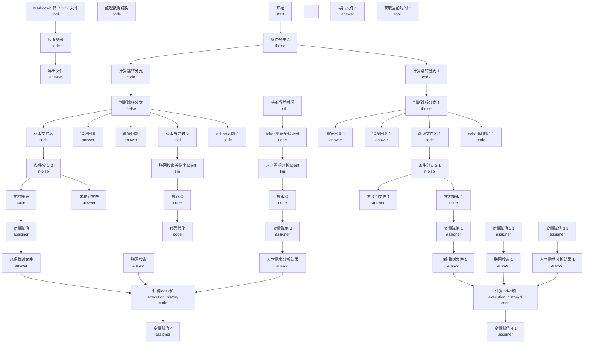

# 托育 - 人才需求分析智能体 - 工作流结构文档

## 节点信息表

| 节点 ID           | 类型     | 标题                                | 描述                         |
| ----------------- | -------- | ----------------------------------- | ---------------------------- |
| `1754636636322`   | start    | 开始                                |                              |
| `1754637066061`   | llm      | 联网搜索关键字 agent                | 用户上传文件和数据库（可选） |
| `1754644265030`   | answer   | 已经收到文件                        |                              |
| `1754644270883`   | code     | 获取文件名                          |                              |
| `1754645557770`   | answer   | 联网搜索                            |                              |
| `1754645946754`   | assigner | 变量赋值                            |                              |
| `1754646472936`   | llm      | 人才需求分析 agent                  |                              |
| `1754646490358`   | answer   | 人才需求分析结果                    |                              |
| `1754647350021`   | code     | 提取器                              |                              |
| `1754649960957`   | answer   | 错误回复                            |                              |
| `17546501512370`  | code     | 提取器                              |                              |
| `1754651516960`   | code     | 整理数据结构                        |                              |
| `1754713960183`   | code     | 文档提取                            |                              |
| `1754772385839`   | assigner | 变量赋值 3                          |                              |
| `1754772651793`   | answer   | 导出文件                            |                              |
| `17548793238850`  | if-else  | 判断跳转分支                        |                              |
| `1754879416268`   | code     | 计算跳转分支                        |                              |
| `17548796543720`  | answer   | 直接回复                            |                              |
| `1754879715500`   | code     | 计算 index 和 execution_history     |                              |
| `1754880002087`   | assigner | 变量赋值 4                          |                              |
| `1754971016691`   | if-else  | 条件分支 2                          |                              |
| `17549710663490`  | answer   | 未收到文件                          |                              |
| `1754991511949`   | code     | echart 转图片                       |                              |
| `1754999309447`   | tool     | 获取当前时间                        |                              |
| `1755255418099`   | code     | 代码转化                            |                              |
| `17552597178210`  | tool     | 获取当前时间                        |                              |
| `1757497049911`   | tool     | Markdown 转 DOCX 文件               |                              |
| `1757507775635`   | code     | token 量安全保证器                  |                              |
| `1761735212120`   | code     | 传服务器                            |                              |
| `1761735753678`   | if-else  | 条件分支 3                          |                              |
| `1761736135525`   |          |                                     |                              |
| `176173627380511` | assigner | 变量赋值 2 (1)                      |                              |
| `176173627380513` | code     | 文档提取 (1)                        |                              |
| `176173627380514` | assigner | 变量赋值 3 (1)                      |                              |
| `176173627380515` | answer   | 导出文件 (1)                        |                              |
| `176173627380516` | if-else  | 判断跳转分支 (1)                    |                              |
| `176173627380517` | code     | 计算跳转分支 (1)                    |                              |
| `176173627380518` | answer   | 直接回复 (1)                        |                              |
| `176173627380519` | code     | 计算 index 和 execution_history (1) |                              |
| `17617362738052`  | answer   | 已经收到文件 (1)                    |                              |
| `176173627380520` | assigner | 变量赋值 4 (1)                      |                              |
| `176173627380521` | if-else  | 条件分支 2 (1)                      |                              |
| `176173627380522` | answer   | 未收到文件 (1)                      |                              |
| `176173627380523` | code     | echart 转图片 (1)                   |                              |
| `176173627380524` | tool     | 获取当前时间 (1)                    |                              |
| `176173627380526` | tool     | 获取当前时间 (1)                    |                              |
| `176173627380527` | tool     | Markdown 转 DOCX 文件 (1)           |                              |
| `176173627380529` | code     | 传服务器 (1)                        |                              |
| `17617362738053`  | code     | 获取文件名 (1)                      |                              |
| `17617362738054`  | answer   | 联网搜索 (1)                        |                              |
| `17617362738055`  | assigner | 变量赋值 (1)                        |                              |
| `17617362738057`  | answer   | 人才需求分析结果 (1)                |                              |
| `17617362738059`  | answer   | 错误回复 (1)                        |                              |
| `1761736317240`   |          |                                     |                              |
| `1761741945019`   | code     | 代码执行 21                         |                              |
| `17617436446190`  | code     | 代码执行 21 (1)                     |                              |
| `1765163992033`   | llm      | 数据筛选 agent                      |                              |
| `1765164099685`   | code     | 提取 json                           |                              |
| `1765164153379`   | code     | 剔除不相干内容                      |                              |
| `1766335411658`   | code     | 代码执行 22                         |                              |
| `1770091124929`   | if-else  | 条件分支 6                          |                              |
| `1770091146541`   | assigner | 变量赋值 9                          |                              |
| `17700911705560`  | answer   | 人才需求分析-修改回复               |                              |
| `1770091319205`   | if-else  | 条件分支 7                          |                              |
| `1770091331592`   | assigner | 变量赋值 10                         |                              |
| `17700913412330`  | answer   | 人才需求分析--修改回复              |                              |
| `1770104708923`   | tool     | 数据 Pipeline（托育）               |                              |
| `1770109415803`   | code     | 过滤重复的数据                      |                              |
| `1770109476978`   | code     | token 量安全保证器 (1)              |                              |
| `1770109738186`   | assigner | 变量赋值 10                         |                              |

## 连接关系图



_注：由于节点数量较多，图中仅显示前 50 个节点和前 100 条连接关系。_

## 数据统计管道输出格式

本智能体依赖**数据 Pipeline（托育）**获取机构、学校、岗位统计数据。Pipeline 输出结构如下，供人才需求分析报告生成时注入 Prompt。

### 输入参数

| 参数            | 类型   | 说明                                             |
| --------------- | ------ | ------------------------------------------------ |
| school          | string | 院校名称（可选）                                 |
| major           | string | 专业名称或代码，如 婴幼儿托育服务与管理 / 520802 |
| region          | string | 区域，省或市，如 广东省 / 广州市                 |
| education_level | string | 学历层次，如 高职专科 / 本科                     |
| started_time    | int    | 调研数据开始年份                                 |

### 输出结构

```json
{
  "stats": {
    "region": {
      "institution_count": 2927,
      "school_count": 189,
      "posting_sample_count": 0,
      "matched_institution_count": 0
    },
    "national": {
      "institution_count": 62668,
      "school_count": 3224,
      "posting_sample_count": 0,
      "matched_institution_count": 0
    }
  },
  "details": {
    "institutions": [
      {
        "institution_name": "机构名",
        "institution_other_name": "机构别名",
        "zoning_name": "区划名称",
        "institution_type": "机构类型",
        "address": "地址"
      }
    ],
    "schools": [
      {
        "机构名称": "学校名",
        "省份": "广东省",
        "开设专业": "婴幼儿托育服务与管理 (520802)",
        "修业年限": "3",
        "年份": "2021"
      }
    ],
    "questionnaire_posting": {},
    "questionnaire_details_sample": [],
    "cross_validation": {
      "region_matched_count": 0,
      "national_matched_count": 0
    }
  },
  "meta": {
    "from_cache": false,
    "fingerprints": {
      "institution": "...",
      "school": "...",
      "questionnaire": "..."
    }
  }
}
```

### 统计字段说明

| 字段                                   | 说明                                 |
| -------------------------------------- | ------------------------------------ |
| stats.region.institution_count         | 区域托育机构总数                     |
| stats.region.school_count              | 区域开设指定专业培养点记录数         |
| stats.region.posting_sample_count      | 区域问卷星有效样本数                 |
| stats.region.matched_institution_count | 机构备案与问卷星匹配数               |
| stats.national.\*                      | 全国维度对应统计                     |
| details.institutions                   | 机构详情列表（上为统计数，下为详情） |
| details.schools                        | 学校详情列表                         |
| details.cross_validation               | 机构与问卷星交叉验证结果             |

## 详细连接关系

### 按源节点分组

#### `1754636636322` - 开始

连接到以下 1 个节点：

- `1761735753678` - 条件分支 3

#### `1754637066061` - 联网搜索关键字 agent

连接到以下 1 个节点：

- `1754647350021` - 提取器

#### `1754644265030` - 已经收到文件

连接到以下 1 个节点：

- `1754879715500` - 计算 index 和 execution_history

#### `1754644270883` - 获取文件名

连接到以下 1 个节点：

- `1754971016691` - 条件分支 2

#### `1754645557770` - 联网搜索

连接到以下 1 个节点：

- `1754879715500` - 计算 index 和 execution_history

#### `1754645946754` - 变量赋值

连接到以下 1 个节点：

- `1754644265030` - 已经收到文件

#### `1754646472936` - 人才需求分析 agent

连接到以下 1 个节点：

- `17546501512370` - 提取器

#### `1754646490358` - 人才需求分析结果

连接到以下 1 个节点：

- `1754879715500` - 计算 index 和 execution_history

#### `1754647350021` - 提取器

连接到以下 1 个节点：

- `1755255418099` - 代码转化

#### `17546501512370` - 提取器

连接到以下 1 个节点：

- `1754772385839` - 变量赋值 3

#### `1754651516960` - 整理数据结构

连接到以下 1 个节点：

- `1770109738186` - 变量赋值 10

#### `1754713960183` - 文档提取

连接到以下 1 个节点：

- `1754645946754` - 变量赋值

#### `1754772385839` - 变量赋值 3

连接到以下 1 个节点：

- `1754646490358` - 人才需求分析结果

#### `17548793238850` - 判断跳转分支

连接到以下 6 个节点：

- `1754644270883` - 获取文件名
- `1754649960957` - 错误回复
- `17548796543720` - 直接回复
- `17552597178210` - 获取当前时间
- `1754991511949` - echart 转图片
- `1770091124929` - 条件分支 6

#### `1754879416268` - 计算跳转分支

连接到以下 1 个节点：

- `17548793238850` - 判断跳转分支

#### `1754879715500` - 计算 index 和 execution_history

连接到以下 1 个节点：

- `1754880002087` - 变量赋值 4

#### `1754971016691` - 条件分支 2

连接到以下 2 个节点：

- `1754713960183` - 文档提取
- `17549710663490` - 未收到文件

#### `1754991511949` - echart 转图片

连接到以下 1 个节点：

- `1766335411658` - 代码执行 22

#### `1754999309447` - 获取当前时间

连接到以下 1 个节点：

- `1757507775635` - token 量安全保证器

#### `1755255418099` - 代码转化

连接到以下 1 个节点：

- `1770104708923` - 数据 Pipeline（托育）

#### `17552597178210` - 获取当前时间

连接到以下 1 个节点：

- `1754637066061` - 联网搜索关键字 agent

#### `1757497049911` - Markdown 转 DOCX 文件

连接到以下 1 个节点：

- `1761735212120` - 传服务器

#### `1757507775635` - token 量安全保证器

连接到以下 1 个节点：

- `1754646472936` - 人才需求分析 agent

#### `1761735212120` - 传服务器

连接到以下 1 个节点：

- `1754772651793` - 导出文件

#### `1761735753678` - 条件分支 3

连接到以下 2 个节点：

- `1754879416268` - 计算跳转分支
- `176173627380517` - 计算跳转分支 (1)

#### `176173627380511` - 变量赋值 2 (1)

连接到以下 1 个节点：

- `17617362738054` - 联网搜索 (1)

#### `176173627380513` - 文档提取 (1)

连接到以下 1 个节点：

- `17617362738055` - 变量赋值 (1)

#### `176173627380514` - 变量赋值 3 (1)

连接到以下 1 个节点：

- `17617362738057` - 人才需求分析结果 (1)

#### `176173627380516` - 判断跳转分支 (1)

连接到以下 6 个节点：

- `176173627380518` - 直接回复 (1)
- `17617362738059` - 错误回复 (1)
- `17617362738053` - 获取文件名 (1)
- `176173627380526` - 获取当前时间 (1)
- `176173627380523` - echart 转图片 (1)
- `1770091319205` - 条件分支 7

#### `176173627380517` - 计算跳转分支 (1)

连接到以下 1 个节点：

- `176173627380516` - 判断跳转分支 (1)

#### `176173627380519` - 计算 index 和 execution_history (1)

连接到以下 1 个节点：

- `176173627380520` - 变量赋值 4 (1)

#### `17617362738052` - 已经收到文件 (1)

连接到以下 1 个节点：

- `176173627380519` - 计算 index 和 execution_history (1)

#### `176173627380521` - 条件分支 2 (1)

连接到以下 2 个节点：

- `176173627380522` - 未收到文件 (1)
- `176173627380513` - 文档提取 (1)

#### `176173627380523` - echart 转图片 (1)

连接到以下 1 个节点：

- `176173627380527` - Markdown 转 DOCX 文件 (1)

#### `176173627380524` - 获取当前时间 (1)

连接到以下 1 个节点：

- `17617436446190` - 代码执行 21 (1)

#### `176173627380526` - 获取当前时间 (1)

连接到以下 1 个节点：

- `1761741945019` - 代码执行 21

#### `176173627380527` - Markdown 转 DOCX 文件 (1)

连接到以下 1 个节点：

- `176173627380529` - 传服务器 (1)

#### `176173627380529` - 传服务器 (1)

连接到以下 1 个节点：

- `176173627380515` - 导出文件 (1)

#### `17617362738053` - 获取文件名 (1)

连接到以下 1 个节点：

- `176173627380521` - 条件分支 2 (1)

#### `17617362738054` - 联网搜索 (1)

连接到以下 1 个节点：

- `176173627380519` - 计算 index 和 execution_history (1)

#### `17617362738055` - 变量赋值 (1)

连接到以下 1 个节点：

- `17617362738052` - 已经收到文件 (1)

#### `17617362738057` - 人才需求分析结果 (1)

连接到以下 1 个节点：

- `176173627380519` - 计算 index 和 execution_history (1)

#### `1761741945019` - 代码执行 21

连接到以下 1 个节点：

- `176173627380511` - 变量赋值 2 (1)

#### `17617436446190` - 代码执行 21 (1)

连接到以下 1 个节点：

- `176173627380514` - 变量赋值 3 (1)

#### `1765163992033` - 数据筛选 agent

连接到以下 1 个节点：

- `1765164099685` - 提取 json

#### `1765164099685` - 提取 json

连接到以下 1 个节点：

- `1765164153379` - 剔除不相干内容

#### `1765164153379` - 剔除不相干内容

连接到以下 1 个节点：

- `1754651516960` - 整理数据结构

#### `1766335411658` - 代码执行 22

连接到以下 1 个节点：

- `1757497049911` - Markdown 转 DOCX 文件

#### `1770091124929` - 条件分支 6

连接到以下 2 个节点：

- `1754999309447` - 获取当前时间
- `1770091146541` - 变量赋值 9

#### `1770091146541` - 变量赋值 9

连接到以下 1 个节点：

- `17700911705560` - 人才需求分析-修改回复

#### `17700911705560` - 人才需求分析-修改回复

连接到以下 1 个节点：

- `1754879715500` - 计算 index 和 execution_history

#### `1770091319205` - 条件分支 7

连接到以下 2 个节点：

- `176173627380524` - 获取当前时间 (1)
- `1770091331592` - 变量赋值 10

#### `1770091331592` - 变量赋值 10

连接到以下 1 个节点：

- `17700913412330` - 人才需求分析--修改回复

#### `17700913412330` - 人才需求分析--修改回复

连接到以下 1 个节点：

- `176173627380520` - 变量赋值 4 (1)

#### `1770104708923` - 数据 Pipeline（托育）

连接到以下 1 个节点：

- `1770109415803` - 过滤重复的数据

#### `1770109415803` - 过滤重复的数据

连接到以下 1 个节点：

- `1770109476978` - token 量安全保证器 (1)

#### `1770109476978` - token 量安全保证器 (1)

连接到以下 1 个节点：

- `1765163992033` - 数据筛选 agent

#### `1770109738186` - 变量赋值 10

连接到以下 1 个节点：

- `1754645557770` - 联网搜索
