# 托育人才培养方案智能体 - 工作流结构文档

## 节点信息表

| 节点ID | 类型 | 标题 | 描述 |
|--------|------|------|------|
| `1754636636322` | start | 开始 |  |
| `1754644265030` | answer | 收到文件 |  |
| `1754644270883` | code | 获取文件名 |  |
| `1754645557770` | answer | 职业面向 |  |
| `1754712904793` | code | 文档提取 |  |
| `1754726710622` | assigner | 产业区域报告 |  |
| `17547277625270` | assigner | 人才需求分析报告 |  |
| `17547277641480` | assigner | 旧人才培养方案 |  |
| `1754728092578` | llm | 职业面向 |  |
| `1754728342040` | code | 提取器 |  |
| `17547295069400` | llm | 培养目标 |  |
| `17547296028240` | llm | 培养规格 |  |
| `17547296247680` | code | 提取器 |  |
| `17547296280240` | answer | 培养目标 |  |
| `17547345751120` | code | 提取器 |  |
| `17547345885940` | answer | 培养规格 |  |
| `17547361889660` | llm | 课程设置 |  |
| `17547362175270` | code | 提取器 |  |
| `17547362315490` | answer | 课程设置 |  |
| `1754736251673` | assigner | 变量赋值 |  |
| `1754736274265` | assigner | 变量赋值 |  |
| `1754736302144` | assigner | 变量赋值 |  |
| `1754736326752` | assigner | 变量赋值 |  |
| `17547367305310` | llm | 教学安排 |  |
| `17547367336160` | code | 提取器 |  |
| `17547367415360` | assigner | 变量赋值 |  |
| `17547367459190` | answer | 教学安排 |  |
| `17547474479350` | llm | 师资队伍 |  |
| `17547474479351` | code | 提取器 |  |
| `17547474479352` | assigner | 变量赋值 |  |
| `17547474479353` | answer | 师资队伍 |  |
| `17547485545140` | llm | 教学设施 |  |
| `17547485545141` | code | 提取器 |  |
| `17547485545142` | assigner | 变量赋值 |  |
| `17547485545143` | answer | 教学设施 |  |
| `17547493371710` | llm | 教学资源 |  |
| `17547493371711` | code | 提取器 |  |
| `17547493371712` | assigner | 变量赋值 |  |
| `17547493371713` | answer | 教学资源 |  |
| `17547498482700` | llm | 教学方案 |  |
| `17547498482701` | code | 提取器 |  |
| `17547498482702` | assigner | 变量赋值 |  |
| `17547498482703` | answer | 教学方案 |  |
| `17547502948300` | llm | 教学评价 |  |
| `17547502948301` | code | 提取器 |  |
| `17547502948302` | assigner | 变量赋值 |  |
| `17547502948303` | answer | 教学评价 |  |
| `17547511881640` | llm |  质量管理 |  |
| `17547511881641` | code | 提取器 |  |
| `17547511881642` | assigner | 变量赋值 |  |
| `17547511881643` | answer |  质量管理 |  |
| `17547527990010` | llm | 毕业要求 |  |
| `17547527990011` | code | 提取器 |  |
| `17547527990012` | assigner | 变量赋值 |  |
| `17547527990013` | answer | 毕业要求 |  |
| `17547535079540` | llm | 最终方案 |  |
| `17547535079541` | code | 提取器 |  |
| `17547535079542` | assigner | 变量赋值 |  |
| `17547535079543` | answer | 最终方案 |  |
| `1754818761708` | code | 计算跳转分支 |  |
| `1754819687876` | if-else | 条件分支 2 |  |
| `1754819745987` | answer | 报错回复 |  |
| `17548201419460` | code | 计算存储的end_index和execution_history |  |
| `1754822280711` | assigner | 变量赋值 |  |
| `17548235485700` | answer | 报错回复 |  |
| `1754895147320` | tool | 获取当前时间 |  |
| `1755503370337` | if-else | 判断用户是否上次步骤内容 |  |
| `17555034605950` | assigner | 变量赋值 |  |
| `17555035304240` | if-else | 判断用户是否上次步骤内容 |  |
| `17555035623290` | assigner | 变量赋值 |  |
| `1755503655457` | if-else | 判断用户是否上次步骤内容 |  |
| `17555037234010` | assigner | 变量赋值 (1) |  |
| `1755503765966` | if-else | 判断用户是否上次步骤内容 |  |
| `17555038181040` | assigner | 变量赋值 |  |
| `1755503842250` | if-else | 判断用户是否上次步骤内容 |  |
| `17555039171020` | assigner | 变量赋值 |  |
| `1755503994692` | if-else | 判断用户是否上次步骤内容 |  |
| `17555040603630` | assigner | 变量赋值 |  |
| `1755504090368` | if-else | 判断用户是否上次步骤内容 |  |
| `17555041232780` | assigner | 变量赋值 |  |
| `1755504704550` | if-else | 判断用户是否上次步骤内容 |  |
| `17555047317720` | assigner | 变量赋值 |  |
| `1755504809253` | if-else | 判断用户是否上次步骤内容 |  |
| `17555048399120` | assigner | 变量赋值 |  |
| `1755504936026` | if-else | 判断用户是否上次步骤内容 |  |
| `17555049737380` | assigner | 变量赋值 |  |
| `1755505002568` | if-else | 判断用户是否上次步骤内容 |  |
| `17555050303230` | assigner | 变量赋值 |  |
| `1755505069078` | if-else | 判断用户是否上次步骤内容 |  |
| `17555050951050` | assigner | 变量赋值 |  |
| `1755505133707` | if-else | 判断用户是否上次步骤内容 |  |
| `17555051877430` | assigner | 变量赋值 |  |
| `1755575009366` | if-else | 判断是否需要替换内容 |  |
| `1755575069890` | if-else | 判断是否需要替换内容 |  |
| `1755575096003` | if-else | 判断是否需要替换内容 |  |
| `1755575175753` | if-else | 判断是否回复 |  |
| `17569666027230` | code | 修复数据格式 |  |
| `17569680255390` | code | 修复数据格式 |  |
| `17569697718730` | answer | 导出文件 |  |
| `1757511421227` | tool | Markdown 转 DOCX 文件 |  |
| `17613926584360` | answer | 职业面向-修改回复 |  |
| `17613927111720` | answer | 培养目标 --修改回复 |  |
| `17613927501790` | answer | 培养规格 --修改回复 |  |
| `17613927855690` | answer | 课程设置 --修改回复 |  |
| `17613928305270` | answer | 教学安排 ---修改回复 |  |
| `17613928848880` | answer | 师资队伍 --修改回复 |  |
| `17613929118790` | answer | 教学设施 --修改回复 |  |
| `17613929128590` | answer | 教学资源 --修改回复 |  |
| `17613929133700` | answer | 教学方案 --修改回复 |  |
| `17613929135310` | answer | 教学评价 --修改回复 |  |
| `17613929136660` | answer |  质量管理 --修改回复  |  |
| `17613929137750` | answer | 毕业要求 --修改回复 |  |
| `17613929139180` | answer | 最终方案 --修改回复  |  |
| `1761735366837` | code | 传服务器 |  |
| `17617451066160` | answer | 收到文件 (1) |  |
| `17617451066161` | code | 获取文件名 (1) |  |
| `1761745106616100` | answer | 培养目标 --修改回复 (1) |  |
| `1761745106616101` | answer | 培养规格 --修改回复 (1) |  |
| `1761745106616102` | answer | 课程设置 --修改回复 (1) |  |
| `1761745106616103` | answer | 教学安排 ---修改回复 (1) |  |
| `1761745106616104` | answer | 师资队伍 --修改回复 (1) |  |
| `1761745106616105` | answer | 教学设施 --修改回复 (1) |  |
| `1761745106616106` | answer | 教学资源 --修改回复 (1) |  |
| `1761745106616107` | answer | 教学方案 --修改回复 (1) |  |
| `1761745106616108` | answer | 教学评价 --修改回复 (1) |  |
| `1761745106616109` | answer |  质量管理 --修改回复  (1) |  |
| `176174510661611` | code | 提取器 (1) |  |
| `1761745106616110` | answer | 毕业要求 --修改回复 (1) |  |
| `1761745106616111` | answer | 最终方案 --修改回复  (1) |  |
| `1761745106616112` | code | 传服务器 (1) |  |
| `176174510661612` | answer | 培养目标 (1) |  |
| `176174510661613` | code | 提取器 (1) |  |
| `176174510661614` | answer | 培养规格 (1) |  |
| `176174510661616` | code | 提取器 (1) |  |
| `176174510661617` | answer | 课程设置 (1) |  |
| `176174510661618` | assigner | 变量赋值 (1) |  |
| `176174510661619` | assigner | 变量赋值 (1) |  |
| `17617451066162` | answer | 职业面向 (1) |  |
| `176174510661620` | assigner | 变量赋值 (1) |  |
| `176174510661621` | assigner | 变量赋值 (1) |  |
| `176174510661623` | code | 提取器 (1) |  |
| `176174510661624` | assigner | 变量赋值 (1) |  |
| `176174510661625` | answer | 教学安排 (1) |  |
| `176174510661627` | code | 提取器 (1) |  |
| `176174510661628` | assigner | 变量赋值 (1) |  |
| `176174510661629` | answer | 师资队伍 (1) |  |
| `17617451066163` | code | 文档提取 (1) |  |
| `176174510661631` | code | 提取器 (1) |  |
| `176174510661632` | assigner | 变量赋值 (1) |  |
| `176174510661633` | answer | 教学设施 (1) |  |
| `176174510661635` | code | 提取器 (1) |  |
| `176174510661636` | assigner | 变量赋值 (1) |  |
| `176174510661637` | answer | 教学资源 (1) |  |
| `176174510661639` | code | 提取器 (1) |  |
| `17617451066164` | assigner | 产业区域报告 (1) |  |
| `176174510661640` | assigner | 变量赋值 (1) |  |
| `176174510661641` | answer | 教学方案 (1) |  |
| `176174510661643` | code | 提取器 (1) |  |
| `176174510661644` | assigner | 变量赋值 (1) |  |
| `176174510661645` | answer | 教学评价 (1) |  |
| `176174510661647` | code | 提取器 (1) |  |
| `176174510661648` | assigner | 变量赋值 (1) |  |
| `176174510661649` | answer |  质量管理 (1) |  |
| `17617451066165` | assigner | 人才需求分析报告 (1) |  |
| `176174510661651` | code | 提取器 (1) |  |
| `176174510661652` | assigner | 变量赋值 (1) |  |
| `176174510661653` | answer | 毕业要求 (1) |  |
| `176174510661655` | code | 提取器 (1) |  |
| `176174510661656` | assigner | 变量赋值 (1) |  |
| `176174510661657` | answer | 最终方案 (1) |  |
| `176174510661658` | code | 计算跳转分支 (1) |  |
| `176174510661659` | if-else | 条件分支 2 (1) |  |
| `17617451066166` | assigner | 旧人才培养方案 (1) |  |
| `176174510661660` | answer | 报错回复 (1) |  |
| `176174510661661` | code | 计算存储的end_index和execution_history (1) |  |
| `176174510661662` | assigner | 变量赋值 (1) |  |
| `176174510661663` | answer | 报错回复 (1) |  |
| `176174510661664` | tool | 获取当前时间 (1) |  |
| `176174510661665` | if-else | 判断用户是否上次步骤内容 (1) |  |
| `176174510661666` | assigner | 变量赋值 (1) |  |
| `176174510661667` | if-else | 判断用户是否上次步骤内容 (1) |  |
| `176174510661668` | assigner | 变量赋值 (1) |  |
| `176174510661669` | if-else | 判断用户是否上次步骤内容 (1) |  |
| `176174510661670` | assigner | 变量赋值 (2) |  |
| `176174510661671` | if-else | 判断用户是否上次步骤内容 (1) |  |
| `176174510661672` | assigner | 变量赋值 (1) |  |
| `176174510661673` | if-else | 判断用户是否上次步骤内容 (1) |  |
| `176174510661674` | assigner | 变量赋值 (1) |  |
| `176174510661675` | if-else | 判断用户是否上次步骤内容 (1) |  |
| `176174510661676` | assigner | 变量赋值 (1) |  |
| `176174510661677` | if-else | 判断用户是否上次步骤内容 (1) |  |
| `176174510661678` | assigner | 变量赋值 (1) |  |
| `176174510661679` | if-else | 判断用户是否上次步骤内容 (1) |  |
| `17617451066168` | code | 提取器 (1) |  |
| `176174510661680` | assigner | 变量赋值 (1) |  |
| `176174510661681` | if-else | 判断用户是否上次步骤内容 (1) |  |
| `176174510661682` | assigner | 变量赋值 (1) |  |
| `176174510661683` | if-else | 判断用户是否上次步骤内容 (1) |  |
| `176174510661684` | assigner | 变量赋值 (1) |  |
| `176174510661685` | if-else | 判断用户是否上次步骤内容 (1) |  |
| `176174510661686` | assigner | 变量赋值 (1) |  |
| `176174510661687` | if-else | 判断用户是否上次步骤内容 (1) |  |
| `176174510661688` | assigner | 变量赋值 (1) |  |
| `176174510661689` | if-else | 判断用户是否上次步骤内容 (1) |  |
| `176174510661690` | assigner | 变量赋值 (1) |  |
| `176174510661691` | if-else | 判断是否需要替换内容 (1) |  |
| `176174510661692` | if-else | 判断是否需要替换内容 (1) |  |
| `176174510661693` | if-else | 判断是否需要替换内容 (1) |  |
| `176174510661694` | if-else | 判断是否回复 (1) |  |
| `176174510661695` | code | 修复数据格式 (1) |  |
| `176174510661696` | code | 修复数据格式 (1) |  |
| `176174510661697` | answer | 导出文件 (1) |  |
| `176174510661698` | tool | Markdown 转 DOCX 文件 (1) |  |
| `176174510661699` | answer | 职业面向-修改回复 (1) |  |
| `1761745207398` | if-else | 条件分支 37 |  |
| `1761749629812` | code | 职业面向 |  |
| `17617497959650` | code | 培养目标 |  |
| `17617498377800` | code | 培养规格 |  |
| `17617498730700` | code | 课程设置 |  |
| `17617498990830` | code | 教学安排 |  |
| `17617499313340` | code | 师资队伍 |  |
| `17617499635330` | code | 教学设施 |  |
| `17617499882200` | code | 教学资源 |  |
| `17617500212690` | code | 教学方案 |  |
| `17617500460290` | code | 教学评价 |  |
| `17617500982980` | code | 质量管理 |  |
| `17617501260780` | code | 毕业要求 |  |
| `17617501803660` | code | 最终方案 |  |

## 连接关系图

```mermaid
graph TD
    Node0["开始<br/>start"]
    Node1["收到文件<br/>answer"]
    Node2["获取文件名<br/>code"]
    Node3["职业面向<br/>answer"]
    Node4["文档提取<br/>code"]
    Node5["产业区域报告<br/>assigner"]
    Node6["人才需求分析报告<br/>assigner"]
    Node7["旧人才培养方案<br/>assigner"]
    Node8["职业面向<br/>llm"]
    Node9["提取器<br/>code"]
    Node10["培养目标<br/>llm"]
    Node11["培养规格<br/>llm"]
    Node12["提取器<br/>code"]
    Node13["培养目标<br/>answer"]
    Node14["提取器<br/>code"]
    Node15["培养规格<br/>answer"]
    Node16["课程设置<br/>llm"]
    Node17["提取器<br/>code"]
    Node18["课程设置<br/>answer"]
    Node19["变量赋值<br/>assigner"]
    Node20["变量赋值<br/>assigner"]
    Node21["变量赋值<br/>assigner"]
    Node22["变量赋值<br/>assigner"]
    Node23["教学安排<br/>llm"]
    Node24["提取器<br/>code"]
    Node25["变量赋值<br/>assigner"]
    Node26["教学安排<br/>answer"]
    Node27["师资队伍<br/>llm"]
    Node28["提取器<br/>code"]
    Node29["变量赋值<br/>assigner"]
    Node30["师资队伍<br/>answer"]
    Node31["教学设施<br/>llm"]
    Node32["提取器<br/>code"]
    Node33["变量赋值<br/>assigner"]
    Node34["教学设施<br/>answer"]
    Node35["教学资源<br/>llm"]
    Node36["提取器<br/>code"]
    Node37["变量赋值<br/>assigner"]
    Node38["教学资源<br/>answer"]
    Node39["教学方案<br/>llm"]
    Node40["提取器<br/>code"]
    Node41["变量赋值<br/>assigner"]
    Node42["教学方案<br/>answer"]
    Node43["教学评价<br/>llm"]
    Node44["提取器<br/>code"]
    Node45["变量赋值<br/>assigner"]
    Node46["教学评价<br/>answer"]
    Node47[" 质量管理<br/>llm"]
    Node48["提取器<br/>code"]
    Node49["变量赋值<br/>assigner"]
    Node2 --> Node4
    Node8 --> Node9
    Node10 --> Node12
    Node11 --> Node14
    Node16 --> Node17
    Node9 --> Node19
    Node19 --> Node3
    Node12 --> Node20
    Node14 --> Node21
    Node21 --> Node15
    Node17 --> Node22
    Node22 --> Node18
    Node23 --> Node24
    Node24 --> Node25
    Node25 --> Node26
    Node20 --> Node13
    Node27 --> Node28
    Node28 --> Node29
    Node29 --> Node30
    Node31 --> Node32
    Node32 --> Node33
    Node33 --> Node34
    Node35 --> Node36
    Node36 --> Node37
    Node37 --> Node38
    Node39 --> Node40
    Node40 --> Node41
    Node41 --> Node42
    Node45 --> Node46
    Node44 --> Node45
    Node43 --> Node44
    Node47 --> Node48
    Node48 --> Node49
```

*注：由于节点数量较多，图中仅显示前50个节点和前100条连接关系。*

## 详细连接关系

### 按源节点分组

#### `1754636636322` - 开始

连接到以下 1 个节点：

- `1761745207398` - 条件分支 37

#### `1754644265030` - 收到文件

连接到以下 1 个节点：

- `17548201419460` - 计算存储的end_index和execution_history

#### `1754644270883` - 获取文件名

连接到以下 1 个节点：

- `1754712904793` - 文档提取

#### `1754645557770` - 职业面向

连接到以下 1 个节点：

- `17548201419460` - 计算存储的end_index和execution_history

#### `1754712904793` - 文档提取

连接到以下 3 个节点：

- `1755575009366` - 判断是否需要替换内容
- `1755575069890` - 判断是否需要替换内容
- `1755575096003` - 判断是否需要替换内容

#### `1754726710622` - 产业区域报告

连接到以下 1 个节点：

- `1755575175753` - 判断是否回复

#### `17547277625270` - 人才需求分析报告

连接到以下 1 个节点：

- `1755575175753` - 判断是否回复

#### `17547277641480` - 旧人才培养方案

连接到以下 1 个节点：

- `1755575175753` - 判断是否回复

#### `1754728092578` - 职业面向

连接到以下 1 个节点：

- `1754728342040` - 提取器

#### `1754728342040` - 提取器

连接到以下 1 个节点：

- `1754736251673` - 变量赋值

#### `17547295069400` - 培养目标

连接到以下 1 个节点：

- `17547296247680` - 提取器

#### `17547296028240` - 培养规格

连接到以下 1 个节点：

- `17547345751120` - 提取器

#### `17547296247680` - 提取器

连接到以下 1 个节点：

- `1754736274265` - 变量赋值

#### `17547296280240` - 培养目标

连接到以下 1 个节点：

- `17548201419460` - 计算存储的end_index和execution_history

#### `17547345751120` - 提取器

连接到以下 1 个节点：

- `1754736302144` - 变量赋值

#### `17547345885940` - 培养规格

连接到以下 1 个节点：

- `17548201419460` - 计算存储的end_index和execution_history

#### `17547361889660` - 课程设置

连接到以下 1 个节点：

- `17547362175270` - 提取器

#### `17547362175270` - 提取器

连接到以下 1 个节点：

- `1754736326752` - 变量赋值

#### `17547362315490` - 课程设置

连接到以下 1 个节点：

- `17548201419460` - 计算存储的end_index和execution_history

#### `1754736251673` - 变量赋值

连接到以下 1 个节点：

- `1754645557770` - 职业面向

#### `1754736274265` - 变量赋值

连接到以下 1 个节点：

- `17547296280240` - 培养目标

#### `1754736302144` - 变量赋值

连接到以下 1 个节点：

- `17547345885940` - 培养规格

#### `1754736326752` - 变量赋值

连接到以下 1 个节点：

- `17547362315490` - 课程设置

#### `17547367305310` - 教学安排

连接到以下 1 个节点：

- `17547367336160` - 提取器

#### `17547367336160` - 提取器

连接到以下 1 个节点：

- `17547367415360` - 变量赋值

#### `17547367415360` - 变量赋值

连接到以下 1 个节点：

- `17547367459190` - 教学安排

#### `17547367459190` - 教学安排

连接到以下 1 个节点：

- `17548201419460` - 计算存储的end_index和execution_history

#### `17547474479350` - 师资队伍

连接到以下 1 个节点：

- `17547474479351` - 提取器

#### `17547474479351` - 提取器

连接到以下 1 个节点：

- `17547474479352` - 变量赋值

#### `17547474479352` - 变量赋值

连接到以下 1 个节点：

- `17547474479353` - 师资队伍

#### `17547474479353` - 师资队伍

连接到以下 1 个节点：

- `17548201419460` - 计算存储的end_index和execution_history

#### `17547485545140` - 教学设施

连接到以下 1 个节点：

- `17547485545141` - 提取器

#### `17547485545141` - 提取器

连接到以下 1 个节点：

- `17547485545142` - 变量赋值

#### `17547485545142` - 变量赋值

连接到以下 1 个节点：

- `17547485545143` - 教学设施

#### `17547485545143` - 教学设施

连接到以下 1 个节点：

- `17548201419460` - 计算存储的end_index和execution_history

#### `17547493371710` - 教学资源

连接到以下 1 个节点：

- `17547493371711` - 提取器

#### `17547493371711` - 提取器

连接到以下 1 个节点：

- `17547493371712` - 变量赋值

#### `17547493371712` - 变量赋值

连接到以下 1 个节点：

- `17547493371713` - 教学资源

#### `17547493371713` - 教学资源

连接到以下 1 个节点：

- `17548201419460` - 计算存储的end_index和execution_history

#### `17547498482700` - 教学方案

连接到以下 1 个节点：

- `17547498482701` - 提取器

#### `17547498482701` - 提取器

连接到以下 1 个节点：

- `17547498482702` - 变量赋值

#### `17547498482702` - 变量赋值

连接到以下 1 个节点：

- `17547498482703` - 教学方案

#### `17547498482703` - 教学方案

连接到以下 1 个节点：

- `17548201419460` - 计算存储的end_index和execution_history

#### `17547502948300` - 教学评价

连接到以下 1 个节点：

- `17547502948301` - 提取器

#### `17547502948301` - 提取器

连接到以下 1 个节点：

- `17547502948302` - 变量赋值

#### `17547502948302` - 变量赋值

连接到以下 1 个节点：

- `17547502948303` - 教学评价

#### `17547502948303` - 教学评价

连接到以下 1 个节点：

- `17548201419460` - 计算存储的end_index和execution_history

#### `17547511881640` -  质量管理

连接到以下 1 个节点：

- `17547511881641` - 提取器

#### `17547511881641` - 提取器

连接到以下 1 个节点：

- `17547511881642` - 变量赋值

#### `17547511881642` - 变量赋值

连接到以下 1 个节点：

- `17547511881643` -  质量管理

#### `17547511881643` -  质量管理

连接到以下 1 个节点：

- `17548201419460` - 计算存储的end_index和execution_history

#### `17547527990010` - 毕业要求

连接到以下 1 个节点：

- `17547527990011` - 提取器

#### `17547527990011` - 提取器

连接到以下 1 个节点：

- `17547527990012` - 变量赋值

#### `17547527990012` - 变量赋值

连接到以下 1 个节点：

- `17547527990013` - 毕业要求

#### `17547527990013` - 毕业要求

连接到以下 1 个节点：

- `17548201419460` - 计算存储的end_index和execution_history

#### `17547535079540` - 最终方案

连接到以下 1 个节点：

- `17547535079541` - 提取器

#### `17547535079541` - 提取器

连接到以下 1 个节点：

- `17569680255390` - 修复数据格式

#### `17547535079542` - 变量赋值

连接到以下 1 个节点：

- `17547535079543` - 最终方案

#### `17547535079543` - 最终方案

连接到以下 1 个节点：

- `17548201419460` - 计算存储的end_index和execution_history

#### `1754818761708` - 计算跳转分支

连接到以下 1 个节点：

- `1754819687876` - 条件分支 2

#### `1754819687876` - 条件分支 2

连接到以下 17 个节点：

- `1754819745987` - 报错回复
- `1754644270883` - 获取文件名
- `17548235485700` - 报错回复
- `1755503370337` - 判断用户是否上次步骤内容
- `17555035304240` - 判断用户是否上次步骤内容
- `1755503655457` - 判断用户是否上次步骤内容
- `1755503765966` - 判断用户是否上次步骤内容
- `1755503842250` - 判断用户是否上次步骤内容
- `1755503994692` - 判断用户是否上次步骤内容
- `1755504090368` - 判断用户是否上次步骤内容
- `1755504704550` - 判断用户是否上次步骤内容
- `1755504809253` - 判断用户是否上次步骤内容
- `1755504936026` - 判断用户是否上次步骤内容
- `1755505002568` - 判断用户是否上次步骤内容
- `1755505069078` - 判断用户是否上次步骤内容
- `1755505133707` - 判断用户是否上次步骤内容
- `1757511421227` - Markdown 转 DOCX 文件

#### `17548201419460` - 计算存储的end_index和execution_history

连接到以下 1 个节点：

- `1754822280711` - 变量赋值

#### `1754895147320` - 获取当前时间

连接到以下 1 个节点：

- `17547535079540` - 最终方案

#### `1755503370337` - 判断用户是否上次步骤内容

连接到以下 2 个节点：

- `1754728092578` - 职业面向
- `17555034605950` - 变量赋值

#### `17555034605950` - 变量赋值

连接到以下 1 个节点：

- `17613926584360` - 职业面向-修改回复

#### `17555035304240` - 判断用户是否上次步骤内容

连接到以下 2 个节点：

- `17547295069400` - 培养目标
- `17555035623290` - 变量赋值

#### `17555035623290` - 变量赋值

连接到以下 1 个节点：

- `17613927111720` - 培养目标 --修改回复

#### `1755503655457` - 判断用户是否上次步骤内容

连接到以下 2 个节点：

- `17547296028240` - 培养规格
- `17555037234010` - 变量赋值 (1)

#### `17555037234010` - 变量赋值 (1)

连接到以下 1 个节点：

- `17613927501790` - 培养规格 --修改回复

#### `1755503765966` - 判断用户是否上次步骤内容

连接到以下 2 个节点：

- `17547361889660` - 课程设置
- `17555038181040` - 变量赋值

#### `17555038181040` - 变量赋值

连接到以下 1 个节点：

- `17613927855690` - 课程设置 --修改回复

#### `1755503842250` - 判断用户是否上次步骤内容

连接到以下 2 个节点：

- `17547367305310` - 教学安排
- `17555039171020` - 变量赋值

#### `17555039171020` - 变量赋值

连接到以下 1 个节点：

- `17613928305270` - 教学安排 ---修改回复

#### `1755503994692` - 判断用户是否上次步骤内容

连接到以下 2 个节点：

- `17547474479350` - 师资队伍
- `17555040603630` - 变量赋值

#### `17555040603630` - 变量赋值

连接到以下 1 个节点：

- `17613928848880` - 师资队伍 --修改回复

#### `1755504090368` - 判断用户是否上次步骤内容

连接到以下 2 个节点：

- `17547485545140` - 教学设施
- `17555041232780` - 变量赋值

#### `17555041232780` - 变量赋值

连接到以下 1 个节点：

- `17613929118790` - 教学设施 --修改回复

#### `1755504704550` - 判断用户是否上次步骤内容

连接到以下 2 个节点：

- `17547493371710` - 教学资源
- `17555047317720` - 变量赋值

#### `17555047317720` - 变量赋值

连接到以下 1 个节点：

- `17613929128590` - 教学资源 --修改回复

#### `1755504809253` - 判断用户是否上次步骤内容

连接到以下 2 个节点：

- `17547498482700` - 教学方案
- `17555048399120` - 变量赋值

#### `17555048399120` - 变量赋值

连接到以下 1 个节点：

- `17613929133700` - 教学方案 --修改回复

#### `1755504936026` - 判断用户是否上次步骤内容

连接到以下 2 个节点：

- `17547502948300` - 教学评价
- `17555049737380` - 变量赋值

#### `17555049737380` - 变量赋值

连接到以下 1 个节点：

- `17613929135310` - 教学评价 --修改回复

#### `1755505002568` - 判断用户是否上次步骤内容

连接到以下 2 个节点：

- `17547511881640` -  质量管理
- `17555050303230` - 变量赋值

#### `17555050303230` - 变量赋值

连接到以下 1 个节点：

- `17613929136660` -  质量管理 --修改回复 

#### `1755505069078` - 判断用户是否上次步骤内容

连接到以下 2 个节点：

- `17547527990010` - 毕业要求
- `17555050951050` - 变量赋值

#### `17555050951050` - 变量赋值

连接到以下 1 个节点：

- `17613929137750` - 毕业要求 --修改回复

#### `1755505133707` - 判断用户是否上次步骤内容

连接到以下 2 个节点：

- `1754895147320` - 获取当前时间
- `17569666027230` - 修复数据格式

#### `17555051877430` - 变量赋值

连接到以下 1 个节点：

- `17613929139180` - 最终方案 --修改回复 

#### `1755575009366` - 判断是否需要替换内容

连接到以下 1 个节点：

- `1754726710622` - 产业区域报告

#### `1755575069890` - 判断是否需要替换内容

连接到以下 1 个节点：

- `17547277625270` - 人才需求分析报告

#### `1755575096003` - 判断是否需要替换内容

连接到以下 1 个节点：

- `17547277641480` - 旧人才培养方案

#### `1755575175753` - 判断是否回复

连接到以下 1 个节点：

- `1754644265030` - 收到文件

#### `17569666027230` - 修复数据格式

连接到以下 1 个节点：

- `17555051877430` - 变量赋值

#### `17569680255390` - 修复数据格式

连接到以下 1 个节点：

- `17547535079542` - 变量赋值

#### `1757511421227` - Markdown 转 DOCX 文件

连接到以下 1 个节点：

- `1761735366837` - 传服务器

#### `17613926584360` - 职业面向-修改回复

连接到以下 1 个节点：

- `17548201419460` - 计算存储的end_index和execution_history

#### `17613927111720` - 培养目标 --修改回复

连接到以下 1 个节点：

- `17548201419460` - 计算存储的end_index和execution_history

#### `17613927501790` - 培养规格 --修改回复

连接到以下 1 个节点：

- `17548201419460` - 计算存储的end_index和execution_history

#### `17613927855690` - 课程设置 --修改回复

连接到以下 1 个节点：

- `17548201419460` - 计算存储的end_index和execution_history

#### `17613928305270` - 教学安排 ---修改回复

连接到以下 1 个节点：

- `17548201419460` - 计算存储的end_index和execution_history

#### `17613928848880` - 师资队伍 --修改回复

连接到以下 1 个节点：

- `17548201419460` - 计算存储的end_index和execution_history

#### `17613929118790` - 教学设施 --修改回复

连接到以下 1 个节点：

- `17548201419460` - 计算存储的end_index和execution_history

#### `17613929128590` - 教学资源 --修改回复

连接到以下 1 个节点：

- `17548201419460` - 计算存储的end_index和execution_history

#### `17613929133700` - 教学方案 --修改回复

连接到以下 1 个节点：

- `17548201419460` - 计算存储的end_index和execution_history

#### `17613929135310` - 教学评价 --修改回复

连接到以下 1 个节点：

- `17548201419460` - 计算存储的end_index和execution_history

#### `17613929136660` -  质量管理 --修改回复 

连接到以下 1 个节点：

- `17548201419460` - 计算存储的end_index和execution_history

#### `17613929137750` - 毕业要求 --修改回复

连接到以下 1 个节点：

- `17548201419460` - 计算存储的end_index和execution_history

#### `17613929139180` - 最终方案 --修改回复 

连接到以下 1 个节点：

- `17548201419460` - 计算存储的end_index和execution_history

#### `1761735366837` - 传服务器

连接到以下 1 个节点：

- `17569697718730` - 导出文件

#### `17617451066160` - 收到文件 (1)

连接到以下 1 个节点：

- `176174510661661` - 计算存储的end_index和execution_history (1)

#### `17617451066161` - 获取文件名 (1)

连接到以下 1 个节点：

- `17617451066163` - 文档提取 (1)

#### `1761745106616100` - 培养目标 --修改回复 (1)

连接到以下 1 个节点：

- `176174510661661` - 计算存储的end_index和execution_history (1)

#### `1761745106616101` - 培养规格 --修改回复 (1)

连接到以下 1 个节点：

- `176174510661661` - 计算存储的end_index和execution_history (1)

#### `1761745106616102` - 课程设置 --修改回复 (1)

连接到以下 1 个节点：

- `176174510661661` - 计算存储的end_index和execution_history (1)

#### `1761745106616103` - 教学安排 ---修改回复 (1)

连接到以下 1 个节点：

- `176174510661661` - 计算存储的end_index和execution_history (1)

#### `1761745106616104` - 师资队伍 --修改回复 (1)

连接到以下 1 个节点：

- `176174510661661` - 计算存储的end_index和execution_history (1)

#### `1761745106616105` - 教学设施 --修改回复 (1)

连接到以下 1 个节点：

- `176174510661661` - 计算存储的end_index和execution_history (1)

#### `1761745106616106` - 教学资源 --修改回复 (1)

连接到以下 1 个节点：

- `176174510661661` - 计算存储的end_index和execution_history (1)

#### `1761745106616107` - 教学方案 --修改回复 (1)

连接到以下 1 个节点：

- `176174510661661` - 计算存储的end_index和execution_history (1)

#### `1761745106616108` - 教学评价 --修改回复 (1)

连接到以下 1 个节点：

- `176174510661661` - 计算存储的end_index和execution_history (1)

#### `1761745106616109` -  质量管理 --修改回复  (1)

连接到以下 1 个节点：

- `176174510661661` - 计算存储的end_index和execution_history (1)

#### `176174510661611` - 提取器 (1)

连接到以下 1 个节点：

- `176174510661619` - 变量赋值 (1)

#### `1761745106616110` - 毕业要求 --修改回复 (1)

连接到以下 1 个节点：

- `176174510661661` - 计算存储的end_index和execution_history (1)

#### `1761745106616111` - 最终方案 --修改回复  (1)

连接到以下 1 个节点：

- `176174510661661` - 计算存储的end_index和execution_history (1)

#### `1761745106616112` - 传服务器 (1)

连接到以下 1 个节点：

- `176174510661697` - 导出文件 (1)

#### `176174510661612` - 培养目标 (1)

连接到以下 1 个节点：

- `176174510661661` - 计算存储的end_index和execution_history (1)

#### `176174510661613` - 提取器 (1)

连接到以下 1 个节点：

- `176174510661620` - 变量赋值 (1)

#### `176174510661614` - 培养规格 (1)

连接到以下 1 个节点：

- `176174510661661` - 计算存储的end_index和execution_history (1)

#### `176174510661616` - 提取器 (1)

连接到以下 1 个节点：

- `176174510661621` - 变量赋值 (1)

#### `176174510661617` - 课程设置 (1)

连接到以下 1 个节点：

- `176174510661661` - 计算存储的end_index和execution_history (1)

#### `176174510661618` - 变量赋值 (1)

连接到以下 1 个节点：

- `17617451066162` - 职业面向 (1)

#### `176174510661619` - 变量赋值 (1)

连接到以下 1 个节点：

- `176174510661612` - 培养目标 (1)

#### `17617451066162` - 职业面向 (1)

连接到以下 1 个节点：

- `176174510661661` - 计算存储的end_index和execution_history (1)

#### `176174510661620` - 变量赋值 (1)

连接到以下 1 个节点：

- `176174510661614` - 培养规格 (1)

#### `176174510661621` - 变量赋值 (1)

连接到以下 1 个节点：

- `176174510661617` - 课程设置 (1)

#### `176174510661623` - 提取器 (1)

连接到以下 1 个节点：

- `176174510661624` - 变量赋值 (1)

#### `176174510661624` - 变量赋值 (1)

连接到以下 1 个节点：

- `176174510661625` - 教学安排 (1)

#### `176174510661625` - 教学安排 (1)

连接到以下 1 个节点：

- `176174510661661` - 计算存储的end_index和execution_history (1)

#### `176174510661627` - 提取器 (1)

连接到以下 1 个节点：

- `176174510661628` - 变量赋值 (1)

#### `176174510661628` - 变量赋值 (1)

连接到以下 1 个节点：

- `176174510661629` - 师资队伍 (1)

#### `176174510661629` - 师资队伍 (1)

连接到以下 1 个节点：

- `176174510661661` - 计算存储的end_index和execution_history (1)

#### `17617451066163` - 文档提取 (1)

连接到以下 3 个节点：

- `176174510661691` - 判断是否需要替换内容 (1)
- `176174510661692` - 判断是否需要替换内容 (1)
- `176174510661693` - 判断是否需要替换内容 (1)

#### `176174510661631` - 提取器 (1)

连接到以下 1 个节点：

- `176174510661632` - 变量赋值 (1)

#### `176174510661632` - 变量赋值 (1)

连接到以下 1 个节点：

- `176174510661633` - 教学设施 (1)

#### `176174510661633` - 教学设施 (1)

连接到以下 1 个节点：

- `176174510661661` - 计算存储的end_index和execution_history (1)

#### `176174510661635` - 提取器 (1)

连接到以下 1 个节点：

- `176174510661636` - 变量赋值 (1)

#### `176174510661636` - 变量赋值 (1)

连接到以下 1 个节点：

- `176174510661637` - 教学资源 (1)

#### `176174510661637` - 教学资源 (1)

连接到以下 1 个节点：

- `176174510661661` - 计算存储的end_index和execution_history (1)

#### `176174510661639` - 提取器 (1)

连接到以下 1 个节点：

- `176174510661640` - 变量赋值 (1)

#### `17617451066164` - 产业区域报告 (1)

连接到以下 1 个节点：

- `176174510661694` - 判断是否回复 (1)

#### `176174510661640` - 变量赋值 (1)

连接到以下 1 个节点：

- `176174510661641` - 教学方案 (1)

#### `176174510661641` - 教学方案 (1)

连接到以下 1 个节点：

- `176174510661661` - 计算存储的end_index和execution_history (1)

#### `176174510661643` - 提取器 (1)

连接到以下 1 个节点：

- `176174510661644` - 变量赋值 (1)

#### `176174510661644` - 变量赋值 (1)

连接到以下 1 个节点：

- `176174510661645` - 教学评价 (1)

#### `176174510661645` - 教学评价 (1)

连接到以下 1 个节点：

- `176174510661661` - 计算存储的end_index和execution_history (1)

#### `176174510661647` - 提取器 (1)

连接到以下 1 个节点：

- `176174510661648` - 变量赋值 (1)

#### `176174510661648` - 变量赋值 (1)

连接到以下 1 个节点：

- `176174510661649` -  质量管理 (1)

#### `176174510661649` -  质量管理 (1)

连接到以下 1 个节点：

- `176174510661661` - 计算存储的end_index和execution_history (1)

#### `17617451066165` - 人才需求分析报告 (1)

连接到以下 1 个节点：

- `176174510661694` - 判断是否回复 (1)

#### `176174510661651` - 提取器 (1)

连接到以下 1 个节点：

- `176174510661652` - 变量赋值 (1)

#### `176174510661652` - 变量赋值 (1)

连接到以下 1 个节点：

- `176174510661653` - 毕业要求 (1)

#### `176174510661653` - 毕业要求 (1)

连接到以下 1 个节点：

- `176174510661661` - 计算存储的end_index和execution_history (1)

#### `176174510661655` - 提取器 (1)

连接到以下 1 个节点：

- `176174510661696` - 修复数据格式 (1)

#### `176174510661656` - 变量赋值 (1)

连接到以下 1 个节点：

- `176174510661657` - 最终方案 (1)

#### `176174510661657` - 最终方案 (1)

连接到以下 1 个节点：

- `176174510661661` - 计算存储的end_index和execution_history (1)

#### `176174510661658` - 计算跳转分支 (1)

连接到以下 1 个节点：

- `176174510661659` - 条件分支 2 (1)

#### `176174510661659` - 条件分支 2 (1)

连接到以下 17 个节点：

- `176174510661660` - 报错回复 (1)
- `17617451066161` - 获取文件名 (1)
- `176174510661665` - 判断用户是否上次步骤内容 (1)
- `176174510661667` - 判断用户是否上次步骤内容 (1)
- `176174510661669` - 判断用户是否上次步骤内容 (1)
- `176174510661671` - 判断用户是否上次步骤内容 (1)
- `176174510661673` - 判断用户是否上次步骤内容 (1)
- `176174510661675` - 判断用户是否上次步骤内容 (1)
- `176174510661677` - 判断用户是否上次步骤内容 (1)
- `176174510661679` - 判断用户是否上次步骤内容 (1)
- `176174510661681` - 判断用户是否上次步骤内容 (1)
- `176174510661683` - 判断用户是否上次步骤内容 (1)
- `176174510661685` - 判断用户是否上次步骤内容 (1)
- `176174510661687` - 判断用户是否上次步骤内容 (1)
- `176174510661689` - 判断用户是否上次步骤内容 (1)
- `176174510661663` - 报错回复 (1)
- `176174510661698` - Markdown 转 DOCX 文件 (1)

#### `17617451066166` - 旧人才培养方案 (1)

连接到以下 1 个节点：

- `176174510661694` - 判断是否回复 (1)

#### `176174510661661` - 计算存储的end_index和execution_history (1)

连接到以下 1 个节点：

- `176174510661662` - 变量赋值 (1)

#### `176174510661664` - 获取当前时间 (1)

连接到以下 1 个节点：

- `17617501803660` - 最终方案

#### `176174510661665` - 判断用户是否上次步骤内容 (1)

连接到以下 2 个节点：

- `176174510661666` - 变量赋值 (1)
- `1761749629812` - 职业面向

#### `176174510661666` - 变量赋值 (1)

连接到以下 1 个节点：

- `176174510661699` - 职业面向-修改回复 (1)

#### `176174510661667` - 判断用户是否上次步骤内容 (1)

连接到以下 2 个节点：

- `176174510661668` - 变量赋值 (1)
- `17617497959650` - 培养目标

#### `176174510661668` - 变量赋值 (1)

连接到以下 1 个节点：

- `1761745106616100` - 培养目标 --修改回复 (1)

#### `176174510661669` - 判断用户是否上次步骤内容 (1)

连接到以下 2 个节点：

- `176174510661670` - 变量赋值 (2)
- `17617498377800` - 培养规格

#### `176174510661670` - 变量赋值 (2)

连接到以下 1 个节点：

- `1761745106616101` - 培养规格 --修改回复 (1)

#### `176174510661671` - 判断用户是否上次步骤内容 (1)

连接到以下 2 个节点：

- `176174510661672` - 变量赋值 (1)
- `17617498730700` - 课程设置

#### `176174510661672` - 变量赋值 (1)

连接到以下 1 个节点：

- `1761745106616102` - 课程设置 --修改回复 (1)

#### `176174510661673` - 判断用户是否上次步骤内容 (1)

连接到以下 2 个节点：

- `176174510661674` - 变量赋值 (1)
- `17617498990830` - 教学安排

#### `176174510661674` - 变量赋值 (1)

连接到以下 1 个节点：

- `1761745106616103` - 教学安排 ---修改回复 (1)

#### `176174510661675` - 判断用户是否上次步骤内容 (1)

连接到以下 2 个节点：

- `176174510661676` - 变量赋值 (1)
- `17617499313340` - 师资队伍

#### `176174510661676` - 变量赋值 (1)

连接到以下 1 个节点：

- `1761745106616104` - 师资队伍 --修改回复 (1)

#### `176174510661677` - 判断用户是否上次步骤内容 (1)

连接到以下 2 个节点：

- `176174510661678` - 变量赋值 (1)
- `17617499635330` - 教学设施

#### `176174510661678` - 变量赋值 (1)

连接到以下 1 个节点：

- `1761745106616105` - 教学设施 --修改回复 (1)

#### `176174510661679` - 判断用户是否上次步骤内容 (1)

连接到以下 2 个节点：

- `176174510661680` - 变量赋值 (1)
- `17617499882200` - 教学资源

#### `17617451066168` - 提取器 (1)

连接到以下 1 个节点：

- `176174510661618` - 变量赋值 (1)

#### `176174510661680` - 变量赋值 (1)

连接到以下 1 个节点：

- `1761745106616106` - 教学资源 --修改回复 (1)

#### `176174510661681` - 判断用户是否上次步骤内容 (1)

连接到以下 2 个节点：

- `176174510661682` - 变量赋值 (1)
- `17617500212690` - 教学方案

#### `176174510661682` - 变量赋值 (1)

连接到以下 1 个节点：

- `1761745106616107` - 教学方案 --修改回复 (1)

#### `176174510661683` - 判断用户是否上次步骤内容 (1)

连接到以下 2 个节点：

- `176174510661684` - 变量赋值 (1)
- `17617500460290` - 教学评价

#### `176174510661684` - 变量赋值 (1)

连接到以下 1 个节点：

- `1761745106616108` - 教学评价 --修改回复 (1)

#### `176174510661685` - 判断用户是否上次步骤内容 (1)

连接到以下 2 个节点：

- `176174510661686` - 变量赋值 (1)
- `17617500982980` - 质量管理

#### `176174510661686` - 变量赋值 (1)

连接到以下 1 个节点：

- `1761745106616109` -  质量管理 --修改回复  (1)

#### `176174510661687` - 判断用户是否上次步骤内容 (1)

连接到以下 2 个节点：

- `176174510661688` - 变量赋值 (1)
- `17617501260780` - 毕业要求

#### `176174510661688` - 变量赋值 (1)

连接到以下 1 个节点：

- `1761745106616110` - 毕业要求 --修改回复 (1)

#### `176174510661689` - 判断用户是否上次步骤内容 (1)

连接到以下 2 个节点：

- `176174510661664` - 获取当前时间 (1)
- `176174510661695` - 修复数据格式 (1)

#### `176174510661690` - 变量赋值 (1)

连接到以下 1 个节点：

- `1761745106616111` - 最终方案 --修改回复  (1)

#### `176174510661691` - 判断是否需要替换内容 (1)

连接到以下 1 个节点：

- `17617451066164` - 产业区域报告 (1)

#### `176174510661692` - 判断是否需要替换内容 (1)

连接到以下 1 个节点：

- `17617451066165` - 人才需求分析报告 (1)

#### `176174510661693` - 判断是否需要替换内容 (1)

连接到以下 1 个节点：

- `17617451066166` - 旧人才培养方案 (1)

#### `176174510661694` - 判断是否回复 (1)

连接到以下 1 个节点：

- `17617451066160` - 收到文件 (1)

#### `176174510661695` - 修复数据格式 (1)

连接到以下 1 个节点：

- `176174510661690` - 变量赋值 (1)

#### `176174510661696` - 修复数据格式 (1)

连接到以下 1 个节点：

- `176174510661656` - 变量赋值 (1)

#### `176174510661698` - Markdown 转 DOCX 文件 (1)

连接到以下 1 个节点：

- `1761745106616112` - 传服务器 (1)

#### `176174510661699` - 职业面向-修改回复 (1)

连接到以下 1 个节点：

- `176174510661661` - 计算存储的end_index和execution_history (1)

#### `1761745207398` - 条件分支 37

连接到以下 2 个节点：

- `1754818761708` - 计算跳转分支
- `176174510661658` - 计算跳转分支 (1)

#### `1761749629812` - 职业面向

连接到以下 1 个节点：

- `17617451066168` - 提取器 (1)

#### `17617497959650` - 培养目标

连接到以下 1 个节点：

- `176174510661611` - 提取器 (1)

#### `17617498377800` - 培养规格

连接到以下 1 个节点：

- `176174510661613` - 提取器 (1)

#### `17617498730700` - 课程设置

连接到以下 1 个节点：

- `176174510661616` - 提取器 (1)

#### `17617498990830` - 教学安排

连接到以下 1 个节点：

- `176174510661623` - 提取器 (1)

#### `17617499313340` - 师资队伍

连接到以下 1 个节点：

- `176174510661627` - 提取器 (1)

#### `17617499635330` - 教学设施

连接到以下 1 个节点：

- `176174510661631` - 提取器 (1)

#### `17617499882200` - 教学资源

连接到以下 1 个节点：

- `176174510661635` - 提取器 (1)

#### `17617500212690` - 教学方案

连接到以下 1 个节点：

- `176174510661639` - 提取器 (1)

#### `17617500460290` - 教学评价

连接到以下 1 个节点：

- `176174510661643` - 提取器 (1)

#### `17617500982980` - 质量管理

连接到以下 1 个节点：

- `176174510661647` - 提取器 (1)

#### `17617501260780` - 毕业要求

连接到以下 1 个节点：

- `176174510661651` - 提取器 (1)

#### `17617501803660` - 最终方案

连接到以下 1 个节点：

- `176174510661655` - 提取器 (1)

